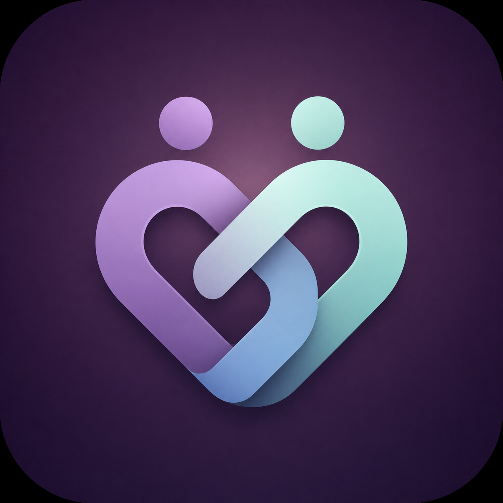
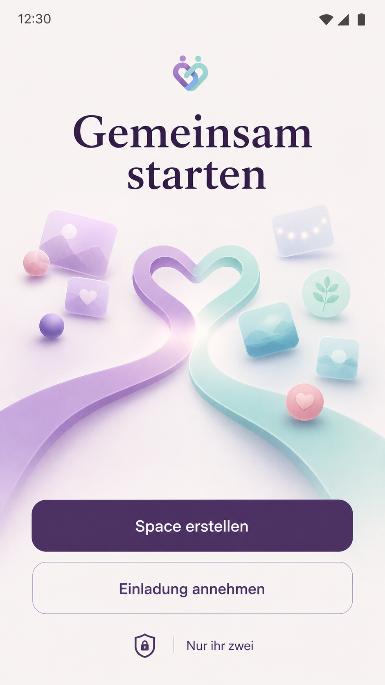
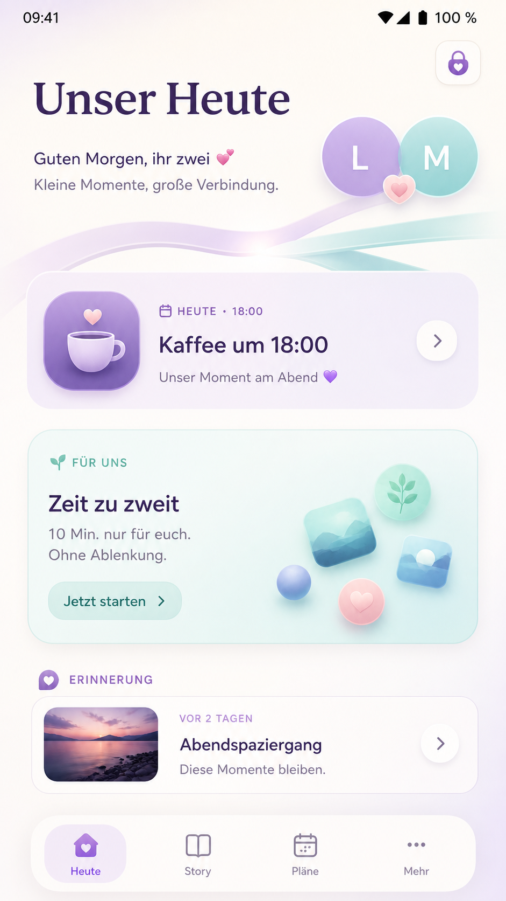
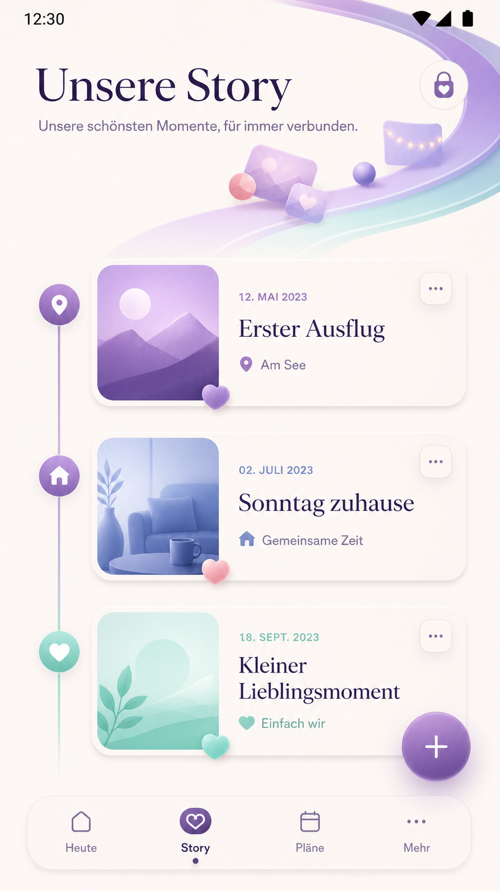
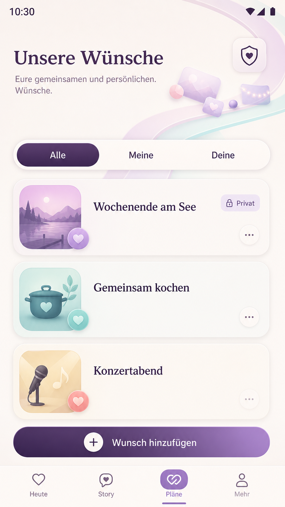
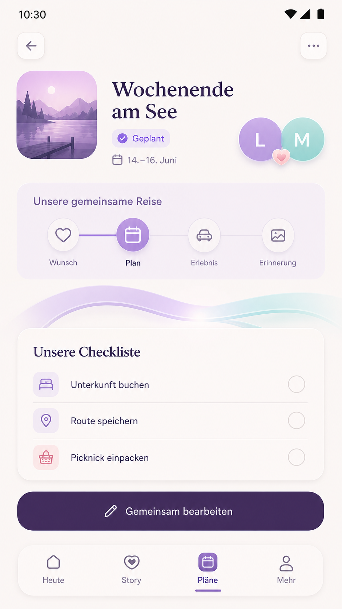
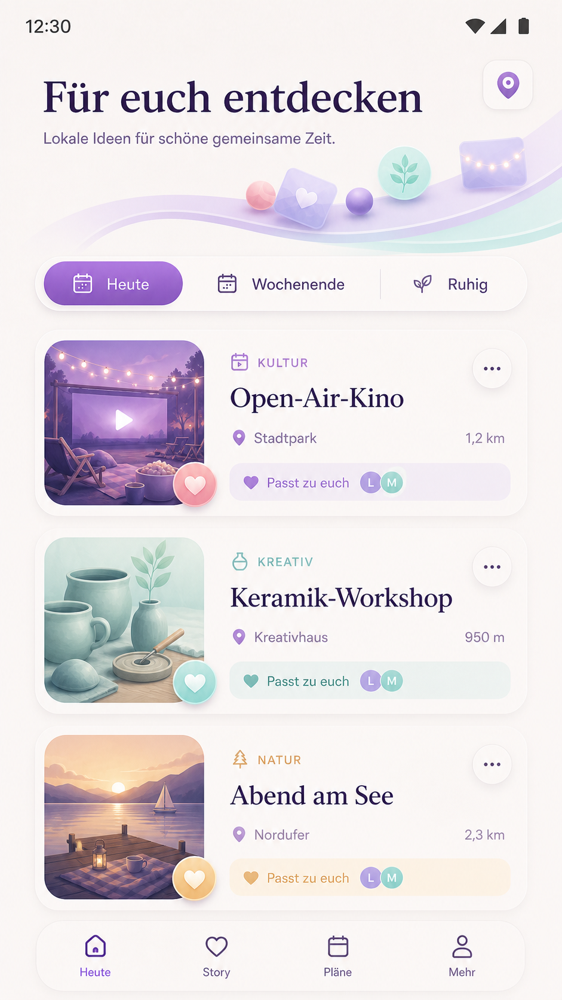
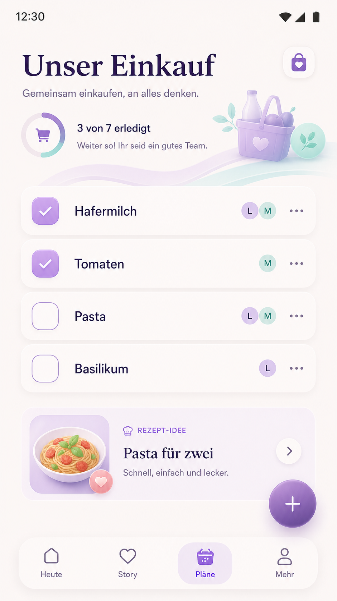
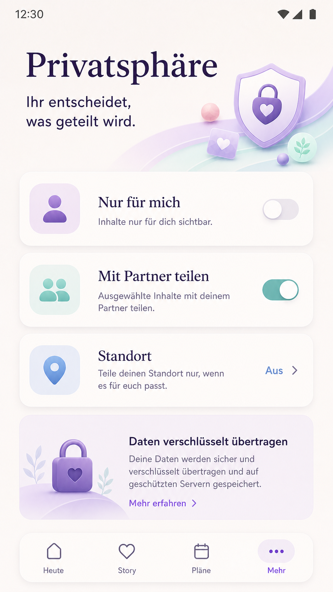

# SideBySide Next

Ein privater digitaler Begleiter für das gemeinsame Leben eines Paares.

SideBySide Next ist eine eigenständige Neuimplementierung. Sie wird in zwei
Betriebsformen angeboten:

- **SideBySide Cloud** — betriebener Dienst für Nutzer, die keine eigene Infrastruktur administrieren möchten
- **SideBySide Self-Hosted** — eigene Installation für persönliche und nichtkommerzielle Nutzung

Beide teilen denselben Application Core. Die Cloud monetarisiert Betrieb,
Komfort und Service; Self-Hosted soll nicht allein zur Verkaufsförderung
künstlich um Kernfunktionen beschnitten werden. Das strategische Modell ist in
[docs/BUSINESS-MODEL.md](docs/BUSINESS-MODEL.md) dokumentiert.

## Produktvorschau

<p align="center">
  
</p>

<p align="center">
  
</p>

<p align="center">
  <strong>Erinnerungen, Wünsche, Pläne und gemeinsame Zeit – ruhig gestaltet und privacy-first gedacht.</strong>
</p>

> Die folgenden Screens sind Produkt- und Google-Play-Mockups. Der technische
> Implementierungsstand ist im Abschnitt [Stand](#stand) dokumentiert.

### Design- und UX-Grundlagen

- [Design-Prinzipien](docs/DESIGN-PRINCIPLES.md) – visuelle Sprache, Accessibility und Privacy-first Leitlinien
- [Informationsarchitektur](docs/INFORMATION-ARCHITECTURE.md) – Navigation, Bereiche, Routen und Deep Links
- [Critical User Flows](docs/USER-FLOWS.md) – End-to-End-Abläufe für Auth, Einladung, Inhalte, Offline und Konflikte
- [UX-Patterns](docs/UX-PATTERNS.md) – plattformübergreifende Interaktions- und Zustandsmuster
- [Screen-Templates](docs/SCREEN-TEMPLATES.md) – responsive Layouts für Compact, Medium und Expanded
- [Component Contracts](docs/COMPONENT-CONTRACTS.md) – Verhalten, Varianten und Accessibility gemeinsamer Bausteine
- [API-/UI-Verträge](docs/API-UI-CONTRACTS.md) – gemeinsame DTOs, Fehler, Privacy-Klassen, Cache und Concurrency
- [Accessibility- und QA-Matrix](docs/ACCESSIBILITY-QA-MATRIX.md) – verbindliche Release Gates für Web und Android
- [Content- und Privacy-Guidelines](docs/CONTENT-PRIVACY-GUIDELINES.md) – Tonalität, Systemtexte, Notifications und Analytics-Grenzen
- [Design-System-Umsetzung](docs/DESIGN-SYSTEM-DELIVERY.md) – Token-Pipeline, Komponentenstufen und Lieferphasen
- [Design-Tokens](design/tokens.json) – Farben, Typografie, Abstände, Layout und Motion als maschinenlesbare Quelle
- [Component Manifest](design/component-manifest.json) – plattformübergreifender Implementierungsstatus

<table>
  <tr>
    <th>Gemeinsam starten</th>
    <th>Unser Heute</th>
    <th>Unsere Story</th>
    <th>Unsere Wünsche</th>
  </tr>
  <tr>
    <td></td>
    <td></td>
    <td></td>
    <td></td>
  </tr>
  <tr>
    <th>Gemeinsam planen</th>
    <th>Für euch entdecken</th>
    <th>Gemeinsam einkaufen</th>
    <th>Privatsphäre</th>
  </tr>
  <tr>
    <td></td>
    <td></td>
    <td></td>
    <td></td>
  </tr>
</table>

## Roadmap

<p align="center">
  <a href="docs/ROADMAP.md">
    
  </a>
</p>

<p align="center">
  <strong>Aktuell: M1-Runtimeumfang umgesetzt; finaler G1-Security-Review vor M2.</strong><br>
  <a href="docs/ROADMAP.md">Roadmap, parallele Arbeitsströme und Release Gates ansehen</a> ·
  <a href="docs/IMPLEMENTATION-STATUS.md">tatsächlichen Umsetzungsstand öffnen</a>
</p>

## Leitsätze

Privatsphäre ist Kernfunktion, nicht Beiwerk. Keine Werbung, kein Verkauf
persönlicher Daten, kein unnötiges Tracking. Sensible Inhalte fließen nicht
in Analytics.

Der zentrale Mandant heißt **Space** — der gemeinsame Raum eines Paares.
Jeder gemeinsame Datensatz gehört genau einem Space. Kein Zugriff erfolgt
allein anhand einer Ressourcen-ID.

## Aufbau

```
backend/        FastAPI, SQLAlchemy 2, Alembic, PostgreSQL
web/            React, TypeScript, Vite
android/        Kotlin, Jetpack Compose
compose.yaml    Docker Compose für Self-Hosted
deploy/         Docker Compose für die Entwicklungsdatenbank
docs/           Architektur, Sicherheit, Datenschutzmodell, Abhängigkeiten
specification/  Produktspezifikation als verbindliche Vorgabe
tools/          Hilfsskripte
```

## Entwicklung

PostgreSQL ist Voraussetzung. Einen SQLite-Notbehelf gibt es bewusst nicht —
das Datenmodell nutzt PostgreSQL-Eigenschaften, und ein zweiter Dialekt im
Test würde eine Sicherheit vortäuschen, die er nicht gibt.

```bash
docker compose -f deploy/docker-compose.dev.yml up -d
python -m pip install uv==0.12.5
cd backend && uv sync --frozen
uv run alembic upgrade head
uv run uvicorn sidebyside.main:app --reload
```

Tests:

```bash
cd backend && uv run pytest                    # alles
cd backend && uv run pytest -m "not integration"   # ohne Datenbank
```

Integrationstests brauchen eine erreichbare PostgreSQL-Instanz. Ohne sie
werden sie übersprungen, nicht stillschweigend als bestanden gewertet.

`backend/uv.lock` ist der verbindliche, plattformübergreifende
Abhängigkeitsstand. Nach einer beabsichtigten API-Änderung wird der
versionierte Vertrag mit `uv run python scripts/openapi_contract.py write`
aktualisiert; die CI vergleicht ihn mit dem Schema der tatsächlichen App.

## Self-Hosted

```bash
cp .env.example .env    # und ausfüllen
docker compose up -d
```

Die API ist danach unter `http://127.0.0.1:8000` erreichbar. Dieser
Klartextzugang ist absichtlich auf den lokalen Rechner begrenzt. Fuer Zugriff
aus LAN oder Internet muss ein HTTPS-Reverse-Proxy vorgeschaltet werden; die
API darf dafuer nicht direkt auf allen Interfaces veroeffentlicht werden.

`compose.yaml` liegt bewusst im Wurzelverzeichnis: der Build-Kontext
`./backend` muss unterhalb des Verzeichnisses liegen, in dem die
Compose-Datei steht. Oberflächen wie Arcane oder Portainer legen jedes
Projekt in einem eigenen Verzeichnis ab — ein Pfad wie `../backend` zeigt
dort ins Leere. Das ganze Repository ist deshalb das Projektverzeichnis.

Der Dienst `migrate` zieht das Schema einmalig hoch, bevor `api` und
`worker` starten. Die Anwendung migriert nicht selbst; zwei startende
API-Container würden das sonst gleichzeitig tun.

Der vollstaendige sichere Startablauf, Reverse-Proxy-Anforderungen und ein
Smoke-Test stehen in [docs/SELF-HOSTING.md](docs/SELF-HOSTING.md).

## Stand

**M0 — technische Plattform abgeschlossen.** Fehlerformat, Transactional
Outbox, Job-Warteschlange, MediaStore- und Provider-Schnittstellen,
ProtectedPayload-Grenze, reproduzierbare Dependencies, OpenAPI-Contract und
CI-/Supply-Chain-Prüfungen sind für den M0-Umfang vorhanden.

**Sicherheitsgrundlage.** Account, Space, Membership, Tenant Context,
Owner-/Privacy-Guard und Geraetesitzungen mit rotierenden Tokens sind
implementiert. Private M1-Ressourcen werden bereits in der SQL-Abfrage nach
Space, Owner und Privacy-Klasse begrenzt.

**M1-Runtimeumfang ist umgesetzt; G1 wartet auf den finalen Review.** Lokales
Passwort, OIDC mit PKCE/State/Nonce, OIDC-Einladungs-Onboarding, Passkeys,
Magic Link, E-Mail-Verifikation, Recovery, Invitations, SpaceProfile,
PartnerProfile/ProfilePreference sowie RelatedPerson/ImportantDate sind im
Backend vorhanden und durch PostgreSQL-/Privacy-/Tenant-Tests abgesichert.

Der historische G1-Review vom 24.08.2026 beschreibt noch damalige Lücken und
wird bewusst nicht umgeschrieben. Der aktuelle operative Stand steht in
[docs/IMPLEMENTATION-STATUS.md](docs/IMPLEMENTATION-STATUS.md). Vor M2 folgt
ein neuer datierter G1-Review; offene Hardening-/Produktpunkte werden unter
anderem in #59, #60 und #61 verfolgt.

Siehe [docs/ARCHITECTURE.md](docs/ARCHITECTURE.md) für den Zielaufbau,
[docs/SECURITY.md](docs/SECURITY.md) für die Sicherheitsinvarianten und
[specification/PRODUCT-SPEC.md](specification/PRODUCT-SPEC.md) für den
fachlichen Umfang.

## Projektsteuerung

Die vollständige verbindliche Vorgabe ist die
[Clean-Room Master Specification](specification/CLEAN-ROOM-MASTER-SPEC.md).
Der [laufende Umsetzungsstand](docs/IMPLEMENTATION-STATUS.md) enthält die
aktuelle Arbeitsliste. Datierte Dateien unter [docs/reviews](docs/reviews)
sind unveränderliche Prüf-Snapshots; bei Widersprüchen gilt immer die
Master-Spezifikation.

Parallele Implementierungsarbeit wird über klar abgegrenzte GitHub Issues,
eigene Branches und Pull Requests koordiniert. Solange Branch Protection bei
diesem privaten Repository tarifbedingt nicht technisch erzwungen werden
kann, gilt die PR-/CI-Pflicht als Projektregel.

## Lizenz

Der eigene SideBySide-Next-Quellcode wird unter der **PolyForm Noncommercial
License 1.0.0** bereitgestellt. Nichtkommerzielle Nutzung, Änderung und
Weitergabe sind im Rahmen dieser Lizenz erlaubt. Für kommerzielle Nutzung ist
eine separate kommerzielle Lizenz des Rechteinhabers erforderlich.

- [LICENSE](LICENSE) — PolyForm Noncommercial License 1.0.0
- [COMMERCIAL-LICENSE.md](COMMERCIAL-LICENSE.md) — kommerzielle Lizenzierung
- [CONTRIBUTING.md](CONTRIBUTING.md) und [CLA.md](CLA.md) — Beiträge und Rechte an Contributions
- [TRADEMARKS.md](TRADEMARKS.md) — Name, Logo und Branding
- [docs/BUSINESS-MODEL.md](docs/BUSINESS-MODEL.md) — Self-Hosted, SideBySide Cloud und Produktprinzipien

SideBySide Next ist damit **source-available**, nicht Open Source im engeren
OSI-Sinn, da kommerzielle Nutzung nicht allgemein freigegeben wird.
Drittanbieter-Abhängigkeiten bleiben unter ihren jeweiligen Lizenzen; die
Pflichten sind in [docs/DEPENDENCIES.md](docs/DEPENDENCIES.md) dokumentiert.
