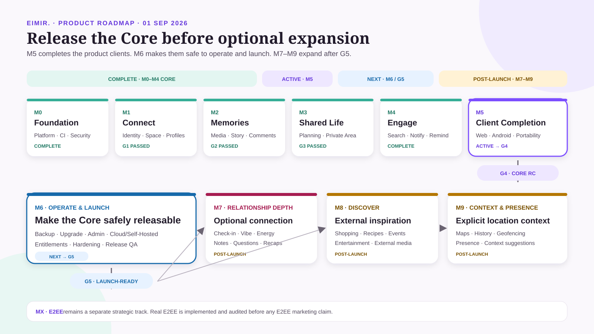
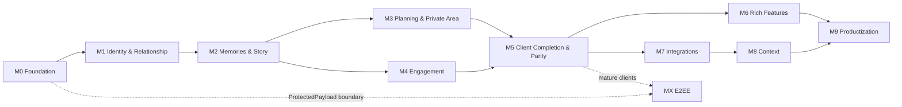

# SideBySide Next Roadmap

**Status:** Menschenlesbare Orientierungs- und Priorisierungsansicht  
**Version:** 1.6  
**Stand:** 25.08.2026  
**Zeitmodell:** Phasen und Release Gates, keine zugesagten Kalendertermine

Diese Roadmap übersetzt die verbindliche Produktspezifikation in eine verständliche Reihenfolge. Sie zeigt Ziel, Abhängigkeiten und Freigabepunkte. Der tatsächliche Arbeitsstand steht im [Implementation Status](./IMPLEMENTATION-STATUS.md); die präzisierten M2-Grenzen stehen im [M2 Project Control](./m2/PROJECT-CONTROL.md).

## Roadmap auf einen Blick



**Aktuell:** M0 und M1 sind für ihren vorgesehenen Runtimeumfang abgeschlossen. **G1 ist bestanden. M2-S0 ist abgeschlossen; die M2-Runtime läuft.** Der verbindliche Gate-Nachweis ist der [G1 Gate Review nach Abschluss von #61](./reviews/2026-08-25-g1-gate-review-after-61.md); der aktuelle Arbeitsstand steht im [M2 Project Control](./m2/PROJECT-CONTROL.md).

#59 und #60 bleiben verpflichtende Pre-Exposure-Härtungen vor öffentlicher bzw. Managed-Exposition. #25 bleibt Repository-Hardening. Diese Punkte blockieren die interne M2-Entwicklung nicht.

## Dokumentenrollen

| Dokument | beantwortet |
|---|---|
| diese Roadmap | Wohin gehen wir, in welcher Reihenfolge und warum? |
| [Implementation Status](./IMPLEMENTATION-STATUS.md) | Was ist auf `main` tatsächlich umgesetzt oder noch offen? |
| [M2 Project Control](./m2/PROJECT-CONTROL.md) | Welche M2/M5-Grenzen, G2-Kriterien und S0-Reihenfolge gelten? |
| [Finaler G1 Gate Review](./reviews/2026-08-25-g1-gate-review-after-61.md) | aktuelle Gate-Entscheidung |
| datierte ältere Reviews | historische Prüfsnapshots, die nicht umgeschrieben werden |
| GitHub Issues/PRs | Welche konkreten Arbeitspakete werden bearbeitet? |
| [Master Specification](../specification/CLEAN-ROOM-MASTER-SPEC.md) | Was ist fachlich und technisch verbindlich? |

## Aktueller Snapshot

### M0 — Foundation: abgeschlossen

API-/DB-Konventionen, Migrationen, Outbox, Jobs, MediaStore-Grundlage, ProtectedPayload-Grenze, versioniertes OpenAPI, PostgreSQL-Integrationstests, Supply-Chain-Prüfungen, Secret Scan und Provenance sind für den Foundation-Umfang vorhanden.

### M1 — Identity & Relationship: abgeschlossen, G1 bestanden

Account/AuthIdentity, Sessions, Space/Membership/Tenant Guard, Invitations, Profile, RelatedPerson/ImportantDate, OIDC, Passkeys, Magic Link, E-Mail-Verifikation und Recovery sind implementiert. PR #64 hat #61 mit expliziter `preserve`-/`cascade`-Semantik ohne destruktiven Default geschlossen; der folgende Gate-Review hat G1 ausdrücklich bestanden erklärt.

### M2-S0 — Readiness & Vertragsentscheidungen: abgeschlossen

Die blockierenden Domain-, Privacy-, Media- und API-Entscheidungen sind über #67, #68, #69, #70 und #78 geschlossen. Alle `BLOCKING`-Einträge im [Decision Log](./m2/DECISION-LOG.md) stehen auf `DECIDED`; offen bleiben nur `BEFORE_CLIENTS`-Punkte, die erst vor stabiler Client-Integration fällig werden.

### M2-Runtime: laufend

1. #71 — Memory CRUD ohne Medien: **geliefert**.
2. #80 — HeartMoment mit Owner-only-Privacy: **geliefert**.
3. #79 — Attachment-Lifecycle für Bilder: **geliefert**. Video folgt nach M2-D23 als eigener Slice (#88).
4. #90 — Attachments an Memory und HeartMoment binden: **geliefert**.
5. #94 — Milestone-Domain und API: **geliefert**.
6. #97 — Comments, Outbox und Notification Hook: **geliefert**.
7. #87 — S3-kompatibler MediaStore-Adapter: **geliefert**.
8. #113 — Story Read Model und `/timeline`: **geliefert**.
9. S8 — dünne Web-/Android-Referenzflows: letzter M2-Baustein vor dem G2-Nachweis.

Die M2-Domain ist damit vollständig. Für G2 fehlt allein der End-to-End-Nachweis auf Web und Android.

Offen daneben: #88 (Video, klärt vorher die ffmpeg-Frage) und #102 (OpenAPI-Generator als Tooling-Vorarbeit vor den Clientflächen).

## Milestones

| Phase | Menschliches Ziel | Fachlicher Umfang | Ergebnis |
|---|---|---|---|
| **M0 · Foundation** | verlässliche technische Basis | API, DB, Outbox, Jobs, MediaStore, CI, Provenance | sicher erweiterbarer Core |
| **M1 · Verbinden** | zwei Personen bilden einen privaten Space | Identity, Auth, Membership, Invitation, Profile | sicherer Account- und Beziehungsrahmen |
| **M2 · Erinnern / Story Alpha** | gemeinsame Geschichte funktioniert als erster vertikaler Kern | Attachments, Memories, HeartMoments, Milestones, Comments, Story plus minimale Web-/Android-Referenzflows | Domain/API vollständig und kritischer E2E-Flow technisch bewiesen |
| **M3 · Planen & Private Area** | Ideen werden gemeinsame Vorhaben | Wishes, Plans, Places, Chapters, Collections, Private Area | Planung und private Ablage mit eigener Privacy-Grenze |
| **M4 · Begleiten** | hilfreiche, kontrollierte Aktivierung | Search/Dashboard, Activity/Notifications, Reminders/Rules | Read Models und Aktivierung ohne unnötiges Tracking |
| **M5 · Client Completion & Parity** | Web und Android sind vollständig nutzbar | vollständige Clientintegration, Export/Import, Read Cache, Deep Links, Accessibility, Performance, Parität | produktfähiger Core auf beiden Clients |
| **M6 · Vertiefen** | freiwillige gemeinsame Reflexion | Questions, Check-in, Monats-/Jahresrückblicke | Rich Features nach stabilem Core |
| **M7 · Entdecken** | externe Inspiration bleibt optional | Shopping, Rezepte, Events, Unterhaltung, Provideradapter | Integrationen ohne Core-Abhängigkeit |
| **M8 · Kontext** | freiwilliger Ortskontext | Location, Karten, Geofencing, Presence | explizit aktivierbare Kontextfunktionen |
| **M9 · Veröffentlichen** | sicher betreibbares Produkt | Self-Hosted, Cloud, Backup, Entitlements, Hardening, Release | launchfähiger Betrieb |
| **MX · E2EE** | echter kryptografischer Schutz | Schlüsselmodell, Migration, Client-Crypto, Recovery | separat bewertete E2EE-Version |

## Präzisierte Milestone-Grenzen

### M2 vs. M5

M2 ist **nicht backend-only**. M2 darf dünne Web-/Android-Referenzflows enthalten, wenn sie notwendig sind, um den kritischen Memory/Media/Story-Flow Ende-zu-Ende zu beweisen. M2 verspricht aber keine vollständige Client-Parität.

M5 ist die vollständige Client-Produktisierung: vollständige Screens und Navigation, Deep Links, Read Cache, Export/Import, systematische Web-/Android-Parität, Accessibility, Performance und Release-Hardening.

### M4 interne Slices

M4 wird intern in drei getrennte Risikoklassen geschnitten:

- **M4-A:** Search + Dashboard Read Models,
- **M4-B:** Activity + Notifications,
- **M4-C:** Reminders + Rules.

Diese Aufteilung ist eine Delivery-Grenze, keine fachliche Scope-Erweiterung.

### Privacy-Sprache

- `SHARED` / `PRIVATE` sind öffentliche fachliche Domainwerte.
- `SPACE_SHARED` / `OWNER_ONLY` sind interne Authorization-/Privacy-Klassen.
- Clients schreiben `privacyClass` nicht redundant als zweite Wahrheitsquelle.

## M2 Lieferfolge

```text
S0 Readiness
   │
   ├── Memory CRUD ohne Medien
   │        │
   │        ├──────────────┐
   │        │              │
   │   Attachment      HeartMoment
   │        │              │
   │        └── Memory+Media
   │
   ├── Milestone
   ├── Comments + Outbox
   └── Story Read Model
              │
              ▼
      Thin Web/Android E2E
              │
              ▼
             G2
```

Der erste Runtime-Slice ist bewusst Memory CRUD ohne Medien. Damit werden M2-Migrationstil, ProtectedPayload, Tenant Guard, Autorregel und Concurrency validiert, bevor die komplexere Media-Sicherheitsfläche hinzukommt.

## Search-Abgrenzung

Für G2 ist globale Volltextsuche nicht zwingend. Der Story-Mindestvertrag umfasst zunächst `type`, `year`, `order`, `cursor` und `limit`. Ein `q`-Filter wird nur dann Bestandteil von G2, wenn #70 ihn nach Privacy-/Index-Review ausdrücklich aufnimmt; ansonsten gehört globale Volltextsuche nach M4-A.

## Abhängigkeiten



## Release Gates

### G0 — Foundation prüfbar

**Bestanden.**

### G1 — Sicherer Paar-Space

- Auth- und Recovery-Wege,
- race-sichere Invitations,
- Tenant Guard und Owner-only-Autorisierung,
- Profile/SpaceProfile mit Versionskonflikten,
- Cross-Tenant-, Session- und Privacy-Tests.

**Aktueller Stand: BESTANDEN.** Der datierte [G1 Gate Review nach Abschluss von #61](./reviews/2026-08-25-g1-gate-review-after-61.md) ist die aktuelle Entscheidungsquelle.

### G2 — Story Alpha

G2 ist bestanden, wenn:

- Memory, Attachment/Media, HeartMoment, Milestone und Comment für den M2-Scope vollständig sind,
- Story `OWNER_ONLY` vor Suche, Gruppierung, Pagination und Projektion ausschließt,
- Upload-/Media-Abuse, Parent-Autorisierung und Cross-Tenant-Races geprüft sind,
- OpenAPI und PostgreSQL-Integrationstests vollständig grün sind,
- mindestens ein kritischer Memory/Media/Story-Flow in **Web und Android** technisch Ende-zu-Ende validiert ist,
- diese Referenzflows Accessibility-/Privacy-Abnahme ohne hohe Befunde bestehen,
- vollständige Client-Parität ausdrücklich noch nicht vorausgesetzt wird.

### G3 — Gemeinsamer Alltag

- Wishes/Plans/Places/Chapters/Collections konsistent,
- Private Area vollständig isoliert,
- Delete-/409-Wirkungen verständlich,
- M4-Read-Model-Grenzen vorbereitet.

### G4 — Core Release Candidate

- Web und Android fachlich gleichwertig,
- Offline Read Cache ohne vorgetäuschten Write Sync,
- Export/Import versioniert und getestet,
- Design-System und Accessibility verifiziert,
- Performance-, Privacy- und Security-Gates bestanden.

### G5 — Launchfähig

- Cloud und Self-Hosted dokumentiert, update- und backupfähig,
- serverseitige Auth-/Provider-Policy je Betriebsform durchgesetzt,
- #59 und #60 vor öffentlicher/Managed-Exposition geschlossen,
- Retention, vollständige Löschung und Supportprozesse geklärt,
- Entitlements/Billing ohne Domainkopplung,
- Monitoring ohne sensible Inhalte,
- Release-, Incident- und Recovery-Prozess getestet.

## Was bewusst nicht vorgezogen wird

- globale Volltextsuche vor geklärter M4-Privacy-/Indexstrategie,
- Shopping, Event Discovery und Providerintegrationen vor stabilem Core,
- Offline Write Sync im MVP,
- öffentliche Share Links,
- KI-Funktionen,
- Location/Geofencing ohne separaten Opt-in- und Privacy-Flow,
- E2EE-Marketing vor echter Implementierung und Review.

## Roadmap-Risiken

| Risiko | Schutzmaßnahme |
|---|---|
| Runtime beginnt vor geklärtem Vertrag | M2-S0 BLOCKING-Decisions und #70 vor #71 |
| Web und Android driften auseinander | gemeinsamer OpenAPI-Vertrag und M5-Paritätsgate |
| Privacy-Klassen werden Client-Domain | klare Trennung `SHARED/PRIVATE` vs. `SPACE_SHARED/OWNER_ONLY` |
| Media erzeugt indirekte Leaks | Parent-Autorisierung, Adapter-Contract und Abuse-/Race-Tests |
| Repository-Gates können umgangen werden | PR-/CI-Pflicht als Projektregel bis #25 technisch erzwingbar ist |
| öffentlicher Betrieb erfolgt zu früh | #59/#60 und G5 bleiben Pre-Exposure-Pflicht |

## Pflege

- Datierte Reviews werden nie nachträglich umgeschrieben.
- Der Current-Marker wird nach jedem abgeschlossenen Gate aktualisiert.
- Offene Aufgaben stehen im Implementation Status und in GitHub Issues.
- Roadmap-Updates nennen Grund und Auswirkung, nicht nur eine neue Reihenfolge.

## Verwandte Dokumente

- [Implementation Status](./IMPLEMENTATION-STATUS.md)
- [M2 Project Control](./m2/PROJECT-CONTROL.md)
- [M2 Technical Readiness Package](./m2/README.md)
- [M2 Decision Log](./m2/DECISION-LOG.md)
- [M2 Delivery Plan](./m2/DELIVERY-PLAN.md)
- [Finaler G1 Gate Review](./reviews/2026-08-25-g1-gate-review-after-61.md)
- [Produktspezifikation](../specification/PRODUCT-SPEC.md)
- [Master Specification](../specification/CLEAN-ROOM-MASTER-SPEC.md)
