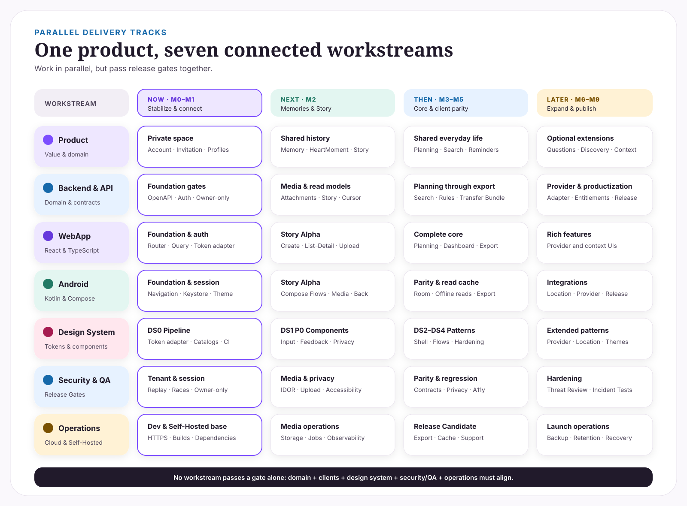
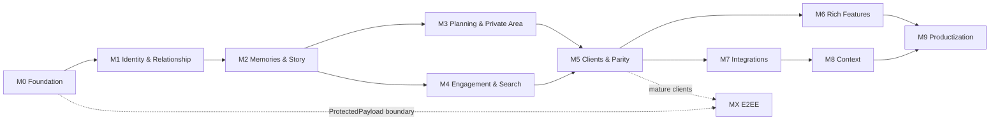

# SideBySide Next Roadmap

**Status:** Menschenlesbare Orientierungs- und Priorisierungsansicht  
**Version:** 1.2  
**Stand:** 25.08.2026  
**Zeitmodell:** Phasen und Release Gates, keine zugesagten Kalendertermine

Diese Roadmap übersetzt die verbindliche Produktspezifikation in eine verständliche Reihenfolge. Sie zeigt Ziel, Abhängigkeiten und Freigabepunkte. Der tatsächliche Arbeitsstand steht ausschließlich im [Implementation Status](./IMPLEMENTATION-STATUS.md).

## Roadmap auf einen Blick

**Aktuell:** M0 ist abgeschlossen und der vorgesehene M1-Runtimeumfang ist umgesetzt. Vor produktivem M2-Runtime-Code folgt der finale, neu datierte Security Review für Gate G1.

## So ist die Roadmap zu lesen

| Dokument | beantwortet |
|---|---|
| diese Roadmap | Wohin gehen wir, in welcher Reihenfolge und warum? |
| [Implementation Status](./IMPLEMENTATION-STATUS.md) | Was ist auf `main` tatsächlich umgesetzt oder noch offen? |
| [G1/M1 Security Review vom 24.08.2026](./reviews/2026-08-24-g1-m1-security-review.md) | Historischer Prüfstand vor Abschluss der damaligen M1-Blocker |
| GitHub Issues/PRs | Welche konkreten Arbeitspakete werden bearbeitet? |
| [Master Specification](../specification/CLEAN-ROOM-MASTER-SPEC.md) | Was ist fachlich und technisch verbindlich? |

- Ein Meilenstein ist kein Datum, sondern ein kohärenter Produkt- und Technikblock.
- Ein Release Gate ist eine prüfbare Bedingung für den nächsten Block.
- „Later“ bedeutet bewusst nach dem Core, nicht unwichtig.
- MX E2EE ist eine eigene strategische Spur und kein stilles Teilversprechen des MVP.

## Aktueller Snapshot

Der Snapshot fasst den [Implementation Status vom 25.08.2026](./IMPLEMENTATION-STATUS.md) zusammen. Datierte Reviews bleiben unveränderliche Prüfsnapshots; der Review vom 24.08.2026 beschreibt deshalb bewusst noch Lücken, die inzwischen geschlossen sind.

### M0 — Clean Foundation: abgeschlossen

Für den aktuellen M0-Umfang sind unter anderem umgesetzt:

- FastAPI, SQLAlchemy 2, PostgreSQL und Alembic,
- REST API v1, camelCase und einheitliches Fehlerformat,
- UUIDv7 sowie Timestamp-/Date-Konventionen,
- Transactional Outbox und PostgreSQL-Job-Queue,
- MediaStore-, Provider- und ProtectedPayload-Grundlagen,
- initiale `web/`, `android/` und `tools/`-Strukturen,
- reproduzierbare Python-Abhängigkeiten mit Lockfile,
- Dependency-/Vulnerability-Scan,
- versionierter OpenAPI-Vertrag mit Contract-Check,
- Backend-/Container-Build,
- echte PostgreSQL-Integrationstests, Secret Scan und Provenance-Prüfung.

M0 wird nicht erneut geöffnet, nur weil spätere Milestones zusätzliche Härtungen auf derselben Infrastruktur benötigen. Neue Findings werden im jeweils betroffenen Issue/Milestone verfolgt.

### M1 — Identity & Relationship: Runtimeumfang umgesetzt, G1 finaler Review offen

Umgesetzt sind unter anderem:

- Account/AuthIdentity, lokaler Passwortlogin und Device Sessions,
- Space, Membership, Tenant Guard und race-sichere Invitations,
- zentrale Owner-/Private-Authorization mit SQL-seitigem `SPACE_SHARED`-/`OWNER_ONLY`-Filter,
- SpaceProfile mit ETag/If-Match, 409-Concurrency und korrekter Benutzerzeitzone,
- PartnerProfile, ProfilePreference, RelatedPerson und ImportantDate,
- OIDC Authorization Code + PKCE mit State/Nonce, Discovery/JWKS, Issuer/Audience/Signaturprüfung,
- OIDC-Onboarding über eine weiterhin beim Callback gültige Einladung ohne E-Mail-Merge,
- WebAuthn-/Passkey-Registration und -Authentication,
- Magic Link, E-Mail-Verifikation und Recovery,
- Refresh-Replay über die gesamte Token-Familie,
- HTTP-/Owner-/Privacy-/Cross-Tenant-/Concurrency-Tests gegen PostgreSQL.

Die früheren G1-Tracking-Issues #7, #11, #24 und #26 sind geschlossen. Der Audit vom 25.08.2026 hat keine neue bekannte Tenant-Isolation- oder Account-Takeover-Lücke ergeben, aber zusätzliche Härtungen und eine Produktentscheidung separat erfasst:

- #59 — Passkey-Authentication-Start gegen Challenge-Flooding absichern,
- #60 — Rate-Limit-Schwellen unter Parallelität atomar erzwingen,
- #61 — beim Löschen einer RelatedPerson explizit zwischen „Termine erhalten“ und „Termine mit löschen“ wählen; Warnung privacy-sicher gestalten,
- #25 — Repository-Ruleset/Branch-Protection bleibt tarifbedingt nicht erzwungen.

### Noch offene Bedingungen vor M2

1. Den aktuellen G1-Audit-/OIDC-Hardening-PR vollständig durch CI prüfen und mergen.
2. Einen **neuen datierten G1-Security-Review** gegen den danach aktuellen `main` erstellen.
3. Im Review #59 und #60 ausdrücklich als G1-Blocker oder als verpflichtende Pre-Exposure-Härtung klassifizieren; nicht still offen lassen.
4. #61 als bewusste Delete-/UX-Policy dokumentiert halten und die serverseitige Preserve/Cascade-Auswahl vor dem ersten betroffenen Clientflow umsetzen.
5. Erst nach positiver G1-Entscheidung M2-S0 und danach M2-Runtime-Code freigeben.

Repository-Hardening #25 bleibt separat offen. Ein nicht erzwungenes Ruleset ist kein Grund, Security-Anforderungen im Code oder die PR-/CI-Pflicht abzusenken.

## Meilensteine

| Phase | Menschliches Ziel | Fachlicher Umfang | Ergebnis |
|---|---|---|---|
| **M0 · Foundation** | verlässliche technische Basis | API, DB, Outbox, Jobs, MediaStore, CI, Provenance | sicher erweiterbarer Core |
| **M1 · Verbinden** | zwei Personen bilden einen privaten Space | Identity, Auth, Membership, Invitation, Profile | sicherer Account- und Beziehungsrahmen |
| **M2 · Erinnern** | gemeinsame Geschichte entsteht | Attachments, Memories, HeartMoments, Milestones, Comments, Story | erster emotionaler Kernflow |
| **M3 · Planen** | Ideen werden gemeinsame Vorhaben | Wishes, Plans, Places, Chapters, Collections, Private Area | Planung und private Ablage |
| **M4 · Begleiten** | hilfreiche, kontrollierte Aktivierung | Reminders, Activity, Notifications, Dashboard, Search, Rules | relevanter Alltag ohne unnötiges Tracking |
| **M5 · Erleben** | Web und Android sind vollständig nutzbar | Export/Import, Web, Android, Read Cache, Parität | produktfähiger Core auf beiden Clients |
| **M6 · Vertiefen** | freiwillige gemeinsame Reflexion | Questions, Check-in, Monats-/Jahresrückblicke | Rich Features nach stabilem Core |
| **M7 · Entdecken** | externe Inspiration bleibt optional | Shopping, Rezepte, Events, Unterhaltung, Medienadapter | Integrationen ohne Core-Abhängigkeit |
| **M8 · Kontext** | freiwilliger Ortskontext | Location, Karten, Geofencing, Presence | explizit aktivierbare Kontextfunktionen |
| **M9 · Veröffentlichen** | sicher betreibbares Produkt | Self-Hosted, Cloud, Backup, Entitlements, Hardening, Release | launchfähiger Betrieb |
| **MX · E2EE** | echter kryptografischer Schutz | Schlüsselmodell, Migration, Client-Crypto, Recovery | separat bewertete E2EE-Version |

## Parallele Arbeitsströme

Die Spuren laufen parallel, aber nicht unabhängig. Eine Clientoberfläche darf einen Domainflow erst als fertig darstellen, wenn API, Autorisierung, Fehlerfälle, Privacy-Tests und plattformspezifische Accessibility gemeinsam erfüllt sind. Für parallele Implementierungsagenten gelten die Koordinationsregeln im [Implementation Status](./IMPLEMENTATION-STATUS.md): ein Issue-Scope pro Branch/PR und keine stillen Scope-Erweiterungen.

## Horizonte

### Now — G1 final prüfen und M2 freigeben

**Umfasst:** Audit-Härtung und formale Gate-Entscheidung nach abgeschlossenem M1-Runtimeumfang.

- OIDC-Discovery-/Audience-Härtung abschließen und CI prüfen,
- neue Audit-Findings #59/#60 sauber klassifizieren und verfolgen,
- RelatedPerson-Delete-Entscheidung #61 als Privacy-/UX-Vertrag festhalten,
- laufende Status-/Security-Dokumentation auf den aktuellen Code ziehen,
- neuen datierten G1-Security-Review gegen aktuellen `main` durchführen.

**Verlassen, wenn:** Gate G1 formell erfüllt und M2 freigegeben ist.

### Next — Der emotionale Kern

**Umfasst:** M2.

- M2-S0: blockierende Domain-, Privacy-, Media- und API-Entscheidungen aus dem Decision Log schließen,
- Memory, Attachment und Media Pipeline,
- HeartMoment mit `OWNER_ONLY`/`SPACE_SHARED`,
- Milestones und sichere Comments,
- abgeleitete Story mit Cursor-Pagination und Privacy-Filtern,
- erste vollständig paritätische End-to-End-Flows in Web und Android.

**Verlassen, wenn:** Gate G2 erfüllt ist.

### Then — Planung, Aktivierung und Client-Parität

**Umfasst:** M3 bis M5.

- Wunsch → Plan → erlebt → optional Chapter,
- Collections und eigenständige private Ablage,
- Suche, Dashboard, Reminder und kontrollierte Notifications,
- Export/Import,
- vollständige Web-/Android-Oberflächen und Android Read Cache,
- Design-System P0/P1 und Accessibility-Gates.

**Verlassen, wenn:** Gate G4 erfüllt ist.

### Later — Freiwillige Erweiterungen und Productization

**Umfasst:** M6 bis M9.

- Fragen, Check-in und Rückblicke,
- Shopping, Discovery und Providerintegrationen,
- optionale Location-/Context-Funktionen,
- serverseitige Managed-/Self-Hosted-Auth-Policy,
- verwaltete Login-Provider wie Google/Apple,
- Self-Hosted- und Cloud-Härtung,
- Backup, Entitlements, Releasebetrieb und Supportfähigkeit.

**Verlassen, wenn:** Gate G5 erfüllt ist.

### Strategic — Echte Ende-zu-Ende-Verschlüsselung

**Umfasst:** MX.

- formales Threat Model und Schlüssel-/Recovery-Produktentscheidung,
- Client-seitige Kryptografie in Web und Android,
- Migration bestehender ProtectedPayload-Daten,
- Auswirkungen auf Suche, Dashboard, Regeln, Notifications und Export,
- unabhängiges Security Review vor jeder E2EE-Aussage.

MX startet erst mit eigenem Scope und Gate. Bis dahin wird E2EE weder versprochen noch grafisch als MVP-Eigenschaft dargestellt.

## Abhängigkeiten

Kritische Reihenfolge:

1. Tenant Isolation und Auth vor sensiblen Inhaltsdomänen.
2. Owner-only-Grundlage vor privaten Inhalten.
3. Media Security vor produktiver Attachment-Nutzung.
4. Memory/Story vor Rückblicken und Discovery-Personalisierung.
5. stabile API und Contract-Tests vor vollständiger Client-Parität.
6. Core-Parität vor Shopping, Location und weiteren Integrationen.

## Release Gates

### G0 — Foundation prüfbar

- API-/DB-Konventionen und Migrationen stabil,
- CI, Integrationstests, Secret Scan und reproduzierbarer Build,
- versioniertes OpenAPI mit Contract-Tests,
- Outbox/Jobs/MediaStore und ProtectedPayload-Grenze abgesichert.

**Aktueller Stand:** bestanden für den M0-Umfang.

### G1 — Sicherer Paar-Space

- Auth- und Recovery-Wege für den jeweiligen Betriebsmodus,
- Invitation atomar, einmalig, widerrufbar und race-sicher,
- Tenant Guard und Owner-only-Autorisierung,
- Profile/SpaceProfile mit Versionskonflikten,
- Cross-Tenant-, Session- und Privacy-Tests grün.

**Aktueller Stand:** die vorgesehenen Runtime-Kriterien sind implementiert; G1 ist **noch nicht formell freigegeben**, bis ein neuer datierter Review den aktuellen `main`, die aktuelle CI und die neuen Audit-Findings bewertet hat. Der Review vom 24.08.2026 bleibt historisch und ist nicht mehr der operative Soll-/Ist-Stand.

### G2 — Story Alpha

- Memory, Media, HeartMoment, Milestone und Comment vollständig,
- Story enthält niemals `OWNER_ONLY`,
- Upload-Missbrauch und signierte URLs geprüft,
- Web und Android bestehen die ersten kritischen Flows,
- Accessibility- und Content-Review ohne hohe Befunde.

### G3 — Gemeinsamer Alltag

- Wünsche/Pläne/Places/Chapters/Collections fachlich konsistent,
- private Ablage vollständig isoliert,
- 409-Konflikte und Delete-Wirkungen verständlich,
- Suche und Dashboard privacy-sicher vorbereitet.

### G4 — Core Release Candidate

- Web und Android fachlich gleichwertig,
- Android Offline Read Cache ohne vorgetäuschten Write Sync,
- Export/Import versioniert und getestet,
- Design-System P0/P1 auf beiden Plattformen verifiziert,
- Performance-, Accessibility-, Privacy- und Security-Gates bestanden.

### G5 — Launchfähig

- Cloud und Self-Hosted dokumentiert, update- und backupfähig,
- serverseitige Auth-/Provider-Policy je Betriebsform durchgesetzt,
- Retention, vollständige Löschung und Supportprozesse geklärt,
- Entitlements/Billing-Adapter ohne Domainkopplung,
- Monitoring ohne sensible Inhalte,
- Release-, Incident- und Recovery-Prozess getestet.

## Was bewusst nicht vorgezogen wird

- Shopping, Event Discovery und Providerintegrationen vor stabilem Core,
- Offline Write Sync im MVP,
- öffentliche Share Links,
- KI-Funktionen,
- Partnerentfernung,
- Location/Geofencing ohne separaten Opt-in- und Privacy-Flow,
- E2EE-Marketing vor echter Implementierung und Review.

## Roadmap-Risiken

| Risiko | Schutzmaßnahme |
|---|---|
| Features beginnen vor offenen Security-Gates | Gate G1 blockiert M2-Freigabe |
| Parallele Agenten überschreiben denselben Scope | ein Issue pro Branch/PR, klarer Owner und Abgleich gegen aktuellen `main` |
| Web und Android driften auseinander | gemeinsamer OpenAPI-Vertrag, Component Contracts und Paritäts-DoD |
| Design-System wird zur Dokumentation ohne Code | Manifest, Tokenadapter, Plattformkataloge und CI-Gates |
| spätere Integrationen dominieren den Core | Provideradapter und klare M7/M8-Grenze |
| Privacy-Sprache übertreibt den Stand | Content Guidelines und unabhängiges Security Review |
| Roadmap wird mit Status verwechselt | Implementation Status bleibt einzige operative Wahrheit |

## Pflege

- Der Current-Marker wird nach jedem abgeschlossenen Gate aktualisiert.
- Meilensteine ändern sich nur bei einer fachlichen Entscheidung in der Spezifikation.
- Offene Aufgaben werden nicht in dieser Datei gepflegt, sondern im Implementation Status und in Issues.
- Ein Roadmap-Update nennt Grund und Auswirkung, nicht nur eine neue Reihenfolge.
- Grafiken und Text werden gemeinsam geändert, wenn sich die dargestellte Phase ändert, damit keine widersprüchlichen Ansichten entstehen.

## Verwandte Dokumente

- [Implementation Status](./IMPLEMENTATION-STATUS.md)
- [Historischer G1/M1 Security Review vom 24.08.2026](./reviews/2026-08-24-g1-m1-security-review.md)
- [Produktspezifikation](../specification/PRODUCT-SPEC.md)
- [Critical User Flows](./USER-FLOWS.md)
- [API-/UI-Verträge](./API-UI-CONTRACTS.md)
- [Design-System-Umsetzung](./DESIGN-SYSTEM-DELIVERY.md)
- [Accessibility- und QA-Matrix](./ACCESSIBILITY-QA-MATRIX.md)
