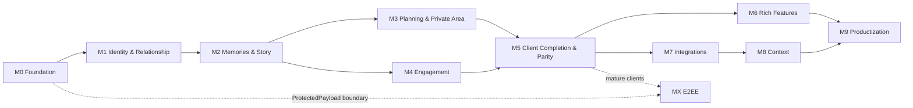

# SideBySide Next Roadmap

**Status:** Human-readable orientation and prioritization view  
**Version:** 2.2
**As of:** August 30, 2026  
**Time model:** phases and Release Gates, no committed calendar dates

This roadmap translates the binding product specification into an understandable sequence. It shows goals, dependencies, and release points. The actual implementation state is tracked in [Implementation Status](./IMPLEMENTATION-STATUS.md); rules for living status sources are defined in [Status Sources and Drift Rules](./STATUS-SOURCES.md); the refined M2 boundaries are documented in [M2 Project Control](./m2/PROJECT-CONTROL.md), and M3 readiness/delivery in the [M3 Technical Readiness Package](./m3/README.md).

## Roadmap at a glance


**Current:** M0, M1, M2, and M3 are complete for their intended scope. **G1, G2, and G3 have passed.** The next roadmap milestone is **M4 — Engage**, beginning with the defined M4-A boundary for Search + Dashboard Read Models. The binding current gate decision is the [final G3 Gate Review](./reviews/2026-08-30-g3-gate-review.md). M3-S10 does not start M4 implementation.

The earlier Pre-Exposure hardening items #59 and #60 and Repository Hardening #25 are complete. The active `main` ruleset enforces Pull Requests, Merge Commits, and the defined required checks.

## Document roles

| Document | Answers |
|---|---|
| this Roadmap | Where are we going, in which order, and why? |
| [Implementation Status](./IMPLEMENTATION-STATUS.md) | What is actually implemented on `main`, and what remains open? |
| [Status Sources and Drift Rules](./STATUS-SOURCES.md) | Which status files are living documents and which are historical snapshots? |
| [M2 Project Control](./m2/PROJECT-CONTROL.md) | Which M2/M5 boundaries and G2 criteria applied? |
| [M3 Technical Readiness Package](./m3/README.md) | Which M3 decisions, delivery rules, and runtime results apply? |
| [M3 G3 Evidence Map](./m3/G3-EVIDENCE.md) | Which executable HTTP/PostgreSQL/race tests constitute the G3 evidence set? |
| [Final G3 Gate Review](./reviews/2026-08-30-g3-gate-review.md) | current gate decision |
| [Final G2 Gate Review](./reviews/2026-08-26-g2-final-gate-review.md) | historical G2 gate decision |
| older dated reviews | historical review snapshots that are never rewritten |
| GitHub Issues/PRs | Which concrete work packages are being handled? |
| [Master Specification](../specification/CLEAN-ROOM-MASTER-SPEC.md) | What is binding from a product and technical perspective? |

## Current snapshot

### M0 — Foundation: complete

API/DB conventions, migrations, Outbox, jobs, MediaStore foundation, ProtectedPayload boundary, versioned OpenAPI, PostgreSQL integration tests, Supply Chain checks, Secret Scan, and Provenance are present for the Foundation scope.

### M1 — Identity & Relationship: complete, G1 passed

Account/AuthIdentity, Sessions, Space/Membership/Tenant Guard, Invitations, Profile, RelatedPerson/ImportantDate, OIDC, Passkeys, Magic Link, email verification, and Recovery are implemented. PR #64 closed #61 with explicit `preserve`/`cascade` semantics and no destructive default; the following Gate Review explicitly declared G1 passed. The later hardening items #59 and #60 and Repository Hardening #25 are also complete.

### M2 — Memories / Story Alpha: complete, G2 passed

The blocking Domain, Privacy, Media, and API decisions are closed. Delivered:

1. #71 — Memory CRUD without media: **delivered**.
2. #80 — HeartMoment with owner-only Privacy: **delivered**.
3. #79 — Attachment lifecycle for images: **delivered**. Video is not part of M2/G2 and is tracked for future development in #88.
4. #90 — Bind Attachments to Memory and HeartMoment: **delivered**.
5. #94 — Milestone Domain and API: **delivered**.
6. #97 — Comments, Outbox, and Notification Hook: **delivered**.
7. #87 — S3-compatible MediaStore adapter: **delivered**.
8. #113 — Story Read Model and `/timeline`: **delivered**.
9. S8 — thin Web/Android reference flows: **delivered**.
10. Real Web/Android Memory/Media/Story E2E against API, Worker, PostgreSQL, and LocalMediaStore: **demonstrated**.

The [final G2 Gate Review](./reviews/2026-08-26-g2-final-gate-review.md) explicitly evaluates the state as **G2: PASSED**. Manual Accessibility acceptance was not counted as passed; it remains part of final client/release QA in M5/G4.

Future backlog: #88 retains video uploads and poster frames for later reevaluation. Prototype #109 was deliberately closed without merge because of a production image of roughly 755 MiB and the additional ffmpeg operational, Supply Chain, and Security burden; `main` remains fail-closed for video.

### M3 — Planning & Private Area: complete, G3 passed

The [M3 Technical Readiness Package](./m3/README.md) records the completed M3 decisions and delivery. M3-D01 through M3-D32 are `DECIDED`, runtime slices S1 through S9 are delivered, and M3-S10 completed the formal gate review.

Delivered are **M3-S1 Wish Foundation**, **M3-S2 Plan + Wish->Plan**, **M3-S3 Place Foundation**, **M3-S4 typed Content Relations**, **M3-S5 Chapter**, **M3-S6 Shared Collections**, **M3-S7 PrivateNote + GiftIdea**, **M3-S8 PrivateCollection**, **M3-S9 Integrated M3 backend/API evidence**, and **M3-S10 G3 Review**. The executable S9 evidence set is indexed in [M3 G3 Evidence Map](./m3/G3-EVIDENCE.md); the immutable [final G3 Gate Review](./reviews/2026-08-30-g3-gate-review.md) concludes **G3: PASSED**.

## Milestones

| Phase | Human goal | Domain scope | Outcome |
|---|---|---|---|
| **M0 · Foundation** | reliable technical foundation | API, DB, Outbox, Jobs, MediaStore, CI, Provenance | safely extensible Core |
| **M1 · Connect** | two people form a private Space | Identity, Auth, Membership, Invitation, Profile | secure Account and relationship foundation |
| **M2 · Memories / Story Alpha** | shared history works as the first vertical Core | Attachments, Memories, HeartMoments, Milestones, Comments, Story plus minimal Web/Android reference flows | Domain/API complete and critical E2E flow technically demonstrated |
| **M3 · Planning & Private Area** | ideas become shared plans | Wishes, Plans, Places, Chapters, Collections, Private Area | planning and private storage with its own Privacy boundary |
| **M4 · Engage** | helpful, controlled activation | Search/Dashboard, Activity/Notifications, Reminders/Rules | Read Models and activation without unnecessary tracking |
| **M5 · Client Completion & Parity** | Web and Android are fully usable | complete client integration, Export/Import, Read Cache, Deep Links, Accessibility, Performance, parity | production-ready Core on both clients |
| **M6 · Deepen** | optional shared reflection | Questions, Check-in, monthly/yearly recaps | Rich Features after a stable Core |
| **M7 · Discover** | external inspiration remains optional | Shopping, Recipes, Events, Entertainment, Provider adapters | integrations without Core dependency |
| **M8 · Context** | optional location context | Location, Maps, Geofencing, Presence | explicitly enabled context features |
| **M9 · Release** | safely operable product | Self-Hosted, Cloud, Backup, Entitlements, Hardening, Release | launch-ready operation |
| **MX · E2EE** | real cryptographic protection | key model, migration, client crypto, Recovery | separately evaluated E2EE version |

## Refined milestone boundaries

### M2 vs. M5

M2 is **not backend-only**. M2 contains thin Web/Android reference flows to demonstrate the critical Memory/Media/Story flow end to end. M2 does not promise full client parity.

M5 is complete client productization: complete screens and navigation, Deep Links, Read Cache, Export/Import, systematic Web/Android parity, Accessibility, Performance, and Release Hardening.

### Internal M4 slices

M4 is internally split into three separate risk classes:

- **M4-A:** Search + Dashboard Read Models,
- **M4-B:** Activity + Notifications,
- **M4-C:** Reminders + Rules.

This split is a delivery boundary, not a domain scope expansion.

### Privacy terminology

- `SHARED` / `PRIVATE` are public domain values.
- `SPACE_SHARED` / `OWNER_ONLY` are internal Authorization/Privacy classes.
- Clients do not redundantly write `privacyClass` as a second source of truth.

## M2 delivery sequence

```text
S0 Readiness
   │
   ├── Memory CRUD without media
   │        │
   │        ├──────────────┐
   │        │              │
   │   Attachment      HeartMoment
   │        │              │
   │        └── Memory+Media
   │
   ├── Milestone
   ├── Comments + Outbox
   └── Story Read Model
              │
              ▼
      Thin Web/Android E2E
              │
              ▼
             G2 ✓
```

This delivery sequence is complete. It first validated the M2 migration style, ProtectedPayload, Tenant Guard, author rule, and Concurrency on a smaller security surface, then continued through the real client E2E evidence.

## Search boundary

Global full-text Search was not part of G2 or G3. The minimum Story contract includes `type`, `year`, `order`, `cursor`, and `limit`; global full-text Search belongs to M4-A.

## Dependencies



## Release Gates

### G0 — Foundation verifiable

**Passed.**

### G1 — Secure couple Space

- Auth and Recovery paths,
- race-safe Invitations,
- Tenant Guard and owner-only Authorization,
- Profile/SpaceProfile with version conflicts,
- cross-tenant, session, and Privacy tests.

**Current state: PASSED.** The dated [G1 Gate Review after completion of #61](./reviews/2026-08-25-g1-gate-review-after-61.md) remains the historical G1 evidence.

### G2 — Story Alpha

**Current state: PASSED.** The [final G2 Gate Review](./reviews/2026-08-26-g2-final-gate-review.md) remains the immutable G2 decision.

Demonstrated in particular:

- complete M2 Domain/API for Memory, image Attachments, HeartMoment, Milestone, Comments, and Story,
- server-side exclusion of `OWNER_ONLY` before Story projection/pagination,
- Media/upload abuse, parent Authorization, tenant, race, and data-integrity paths,
- OpenAPI, migrations, and PostgreSQL integration,
- real critical Memory/Media/Story flow in Web and Android against the same SideBySide stack,
- current CI, Secret Scan, Supply Chain, and Deployment gates at the G2 checkpoint.

Manual Accessibility acceptance is deliberately **no longer a G2 blocker** and is performed in M5/G4 as final client/release QA. Full client parity likewise remains M5/G4.

### G3 — Shared everyday use

- Wishes/Plans/Places/Chapters/Collections consistent,
- Private Area fully isolated,
- Delete/409 effects understandable,
- M4 Read Model boundaries prepared.

**Current state: PASSED.** M3-S9 assembled the executable real HTTP/PostgreSQL evidence, and the [final G3 Gate Review](./reviews/2026-08-30-g3-gate-review.md) evaluated the merged S9 tree, exact successful workflow runs, all five mandatory M3-D24 flows, negative/race/redaction/contract evidence, and current open findings.

Complete Web/Android productization, systematic parity, Accessibility, Read Cache, Export/Import, Deep Links, and client performance remain M5/G4 and were not treated as G3 requirements.

### G4 — Core Release Candidate

- Web and Android domain-equivalent,
- Offline Read Cache without pretending Write Sync exists,
- Export/Import versioned and tested,
- Design System and Accessibility verified,
- Performance, Privacy, and Security gates passed.

### G5 — Launch-ready

- Cloud and Self-Hosted documented, updatable, and backup-capable,
- server-side Auth/Provider policy enforced per operating model,
- Pre-Exposure hardening #59 and #60 complete,
- Retention, complete deletion, and support processes resolved,
- Entitlements/Billing without Domain coupling,
- Monitoring without sensitive content,
- Release, Incident, and Recovery process tested.

## Deliberately not pulled forward

- global full-text Search before the M4 Privacy/index strategy is resolved,
- Shopping, Event Discovery, and Provider integrations before a stable Core,
- Offline Write Sync in the MVP,
- public Share Links,
- AI features,
- Location/Geofencing without a separate opt-in and Privacy flow,
- E2EE marketing before real implementation and review.

## Roadmap risks

| Risk | Safeguard |
|---|---|
| Runtime starts before the contract is resolved | relevant milestone decisions + contract-testable OpenAPI contract before runtime slices |
| Web and Android drift apart | shared OpenAPI contract and M5 parity gate |
| Privacy classes become Client Domain | clear separation of `SHARED/PRIVATE` vs. `SPACE_SHARED/OWNER_ONLY` |
| Media creates indirect leaks | parent Authorization, adapter contract, and abuse/race tests |
| Repository gates are bypassed | active `main` ruleset enforces Pull Request, Merge Commit, and required checks |
| public operation starts too early | G5 remains a mandatory Pre-Exposure/launch gate |

## Maintenance

- Dated reviews are never rewritten retroactively.
- Domain current markers are updated after completed gate/milestone/slice changes; static supposedly current `main` SHAs are not kept in living status files.
- Open tasks live in Implementation Status and GitHub Issues; explicitly open Issue tasks are checked automatically against GitHub.
- Roadmap updates state the reason and impact, not merely a new sequence.

## Related documents

- [Implementation Status](./IMPLEMENTATION-STATUS.md)
- [Status Sources and Drift Rules](./STATUS-SOURCES.md)
- [M2 Project Control](./m2/PROJECT-CONTROL.md)
- [M3 Technical Readiness Package](./m3/README.md)
- [M3 Decision Log](./m3/DECISION-LOG.md)
- [M3 Delivery Plan](./m3/DELIVERY-PLAN.md)
- [M3 G3 Evidence Map](./m3/G3-EVIDENCE.md)
- [Final G3 Gate Review](./reviews/2026-08-30-g3-gate-review.md)
- [Final G2 Gate Review](./reviews/2026-08-26-g2-final-gate-review.md)
- [Product Specification](../specification/PRODUCT-SPEC.md)
- [Master Specification](../specification/CLEAN-ROOM-MASTER-SPEC.md)
