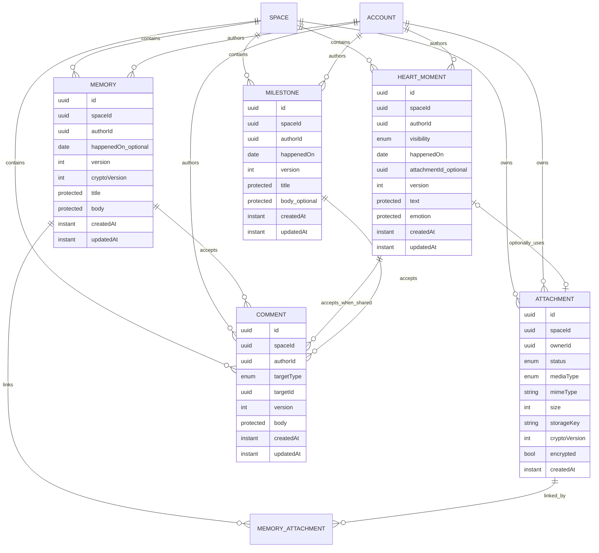

# M2 Domain Model

**Status:** Verbindlicher Domain-/Privacy-Entwurf nach M2-S0 #68; Media-/API-Details bleiben bis #69/#70 offen  
**Version:** 1.1

## 1. Modellübersicht



`MEMORY_ATTACHMENT` ist eine technische Relationsskizze, weil Memories mehrere Medien besitzen. Name und konkrete Persistenzform bleiben bis #69 eine Open-Decision; eine generische Universalrelation ist nicht beabsichtigt.

## 2. Sichtbarkeitsbegriffe

Die öffentliche Domain-/API-Sprache und die interne Authorization-Sprache sind bewusst getrennt:

| Ebene | Werte | Vertrag |
|---|---|---|
| Domain/API | `SHARED`, `PRIVATE` | fachliche Sichtbarkeit; Clientwert |
| Authorization/Persistenz | `SPACE_SHARED`, `OWNER_ONLY` | interne Zugriffsklasse; nicht als redundanter Clientwert schreibbar |

`PRIVATE` wird serverseitig auf `OWNER_ONLY`, `SHARED` auf `SPACE_SHARED` abgebildet. Ressourcen, die fachlich immer gemeinsam sind (Memory, Milestone), benötigen kein frei schreibbares Visibility-Feld. Diese Trennung verhindert zwei konkurrierende Wahrheitsquellen.

## 3. Domain-Verträge

### Memory

| Aspekt | Vertrag |
|---|---|
| Privacy | gemeinsamer Space-Inhalt; intern `SPACE_SHARED` |
| Autor | bei Create aus Authorization Context; danach unveränderlich |
| Inhalt | `title`, `body` in ProtectedPayload-Grenze |
| Datum | `happenedOn` optional und getrennt von `createdAt` |
| Medien | mehrere Attachments; Relation erst nach #69 verbindlich |
| Schreiben | ausschließlich Autor; Partner erhält keine Update-/Delete-Vollmacht durch Shared-Lesbarkeit |
| Lesen | beide aktiven Space-Partner |
| Story | immer zulässig, sofern nicht gelöscht |
| Suche | globale Volltextsuche nicht G2-pflichtig; M4-Scope |
| Concurrency | `version`, 409 bei veraltetem Update/Delete |

Nicht-inhaltliche Felder unterliegen derselben Autorregel. Eine spätere kollaborative Bearbeitung ist eine neue Domainfunktion und kein stilles Aufweichen dieser Invariante.

### HeartMoment

| Aspekt | Vertrag |
|---|---|
| Privacy | Domain `PRIVATE` → intern `OWNER_ONLY`; Domain `SHARED` → intern `SPACE_SHARED` |
| Pflichtfelder | Text, Emotion, Sichtbarkeit, `happenedOn` |
| Emotionen | `LOVED`, `SEEN`, `APPRECIATED`, `SUPPORTED`, `GRATEFUL`, `HAPPY` |
| Emotion-Klassifikation | ProtectedPayload; nicht Analytics-/Event-/Log-Metadatum |
| Medien | maximal ein optionales Attachment laut aktuellem Modell; Media-Vertrag #69 |
| Kommentare | nur `SHARED`; bei `SHARED -> PRIVATE` atomar löschen |
| Story | nur `SHARED` |
| Partnerzugriff bei PRIVATE | niemals – auch nicht indirekt |
| Concurrency | `version`, 409 bei veraltetem Update/Delete/Privacy-Wechsel |

Ein Privacy-Wechsel ist eine Domainoperation, keine reine Clientdarstellung. `PRIVATE` darf nicht zunächst geladen und anschließend im Client herausgefiltert werden. `SHARED -> PRIVATE` setzt die interne Klasse und löscht vorhandene Comments in derselben DB-Transaktion; `PRIVATE -> SHARED` stellt sie nicht wieder her.

### Milestone

| Aspekt | Vertrag |
|---|---|
| Privacy | gemeinsamer Space-Inhalt, intern `SPACE_SHARED` |
| Modell | eigenständige Entität, kein spezieller Listentyp |
| Pflichtfelder | Titel, `happenedOn`, Autor |
| Optional | Body |
| Autor | unveränderlich |
| Story | ja |
| Kommentare | ja |
| Spätere Nutzung | Chapter, Suche, Jahresrückblick |
| Concurrency | `version` |

Die Partner-Schreibregel ist mit M2-D25 entschieden: beide lesen, Update und Delete bleiben beim unveränderlichen Autor — dieselbe Regel wie für Memory. Aus geteilter Lesbarkeit folgt keine Schreibvollmacht. Ein späteres gemeinsames Bearbeiten benötigt eine neue Entscheidung und eine eigene Regel in `authorization.rules`, nicht eine Ausnahme im Endpunkt.

### Attachment

| Aspekt | Vertrag |
|---|---|
| Ownership | genau ein `spaceId`, genau ein `ownerId` |
| Lifecycle | `PENDING → upload → validation → READY`, Fehler `FAILED`; Details #69 |
| Storage | `LocalMediaStore` oder `S3MediaStore` hinter Interface |
| Storage Key | nie aus Benutzerdateiname; UUID-basierter Space-Pfad |
| Metadaten | Typ, MIME, Größe, optionale Breite/Höhe/Dauer, Originalname; Privacy-/Retentiondetails #69 |
| Crypto | `cryptoVersion`, `encrypted`; Storage setzt Klartext nicht voraus |
| Lesen | nach Membership/Resource-Autorisierung über Streamingroute oder kurzlebige URL |
| Öffentlichkeit | niemals öffentlich |

Attachment-Berechtigung folgt nicht nur dem Attachment selbst, sondern auch der autorisierten Zielressource. Ein Owner-only HeartMoment darf kein Attachment über eine alternative Route an den Partner leaken.

### Comment

| Aspekt | Vertrag |
|---|---|
| Targets | kontrolliertes Enum: `MEMORY`, `MILESTONE`, `HEART_MOMENT` |
| HeartMoment | nur wenn `SHARED` |
| Privacy | erbt Erreichbarkeit der Zielressource; kein eigenständiges Public/Private |
| Autor | unveränderlich; nur Autor darf eigenen Body bearbeiten/löschen |
| Concurrency | persistiertes `version`; Update/Delete mit If-Match, stale → 409 |
| Parent-Delete | Comments werden als abhängige Domainobjekte atomar mit Parent gelöscht |
| HeartMoment privat schalten | vorhandene Comments werden atomar gelöscht |
| Event | Kommentar auf fremdem gemeinsamen Inhalt → Domain Event ohne Body |
| Notification | an Content-Autor, optional Push; keine unnötigen Textpayloads |

Serverseitige Parent-Cascade-/Privacy-Operationen dürfen abhängige Comments unabhängig vom Comment-Autor entfernen; sie sind keine Benutzer-Edit-Operation und benötigen kein vom Comment-Autor geliefertes If-Match.

## 4. Privacy-Matrix

| Ressource | Autor | Partner im Space | fremder Space | Story | Suche | Partnerexport | Kommentar |
|---|---:|---:|---:|---:|---:|---:|---:|
| Memory | CRUD | Lesen | niemals | ja | später M4 | ja | ja |
| HeartMoment SHARED | CRUD | Lesen | niemals | ja | später M4 | ja | ja |
| HeartMoment PRIVATE | CRUD | niemals | niemals | niemals | nur Owner, falls später angeboten | niemals | niemals |
| Milestone | CRUD* | Lesen | niemals | ja | später M4 | ja | ja |
| Attachment an Shared-Ziel | gemäß Ziel | gemäß Ziel | niemals | über Ziel | über Ziel | gemäß Ziel | n/a |
| Attachment an Owner-only-Ziel | Owner | niemals | niemals | niemals | niemals für Partner | niemals | n/a |
| Comment | eigener Inhalt CRUD | lesen gemäß Ziel | niemals | über Ziel | nicht G2 | gemäß Ziel | n/a |

`*` Milestone-Partner-Schreibrechte werden vor dessen Runtime-Slice separat bestätigt; bis dahin Autor-only als sichere Default-Annahme.

„Partner im Space“ bedeutet aktive Membership im selben Space. Ein Zugriff allein anhand einer Resource-ID ist nie zulässig.

## 5. ProtectedPayload-Grenze

### Metadata

- IDs und Tenant-/Autorreferenzen,
- fachliche Sortierdaten wie `happenedOn`,
- technische Zeitpunkte und `version`,
- `cryptoVersion`,
- für Ableitungen zwingend notwendige, nicht-inhaltliche Zustände.

### ProtectedPayload

- Memory `title` und `body`,
- HeartMoment `text` und `emotion`,
- Milestone `title` und `body`,
- Comment `body`,
- weitere sensible Inhaltsfelder.

Version 1 darf Payloads als Klartext speichern, aber Domain-, API-, Persistenz- und Outbox-Grenzen dürfen keinen Klartext als dauerhaft notwendige Form voraussetzen. Diese Bereitschaft ist keine echte E2EE.

ProtectedPayload wird nicht in Analytics, Logfeldern, Metriklabels, Notification-Previews oder Domain-Event-Payloads dupliziert. Berechtigte Ressourcen-Responses dürfen den Inhalt selbstverständlich nach erfolgreicher Autorisierung liefern.

## 6. Story Read Model

```text
Memory ───────────────┐
HeartMoment SHARED ───┼── StoryQueryService ── CursorPage<StoryItem>
Milestone ────────────┘

HeartMoment PRIVATE ──X── niemals Teil der Story-Abfrage
```

Story wird nicht persistiert. Jedes Item referenziert sein Original und enthält nur die für Timeline, Autor, Medienvorschau und Navigation notwendigen Daten.

Sortierung und Cursor werden in #70 / M2-D08 verbindlich entschieden. Globale Volltextsuche `q` ist nicht Teil der G2-Mindestanforderung und bleibt grundsätzlich M4.

## 7. Domain Events

Jedes M2-Event verwendet mindestens:

```text
eventId
eventType
occurredAt
spaceId
actorId
resourceType
resourceId
resourceVersion
```

Event-spezifisch sind nur weitere IDs, technische Zeitpunkte und explizit sichere Zustände/Kategorien zulässig. Verboten sind ProtectedPayload, Comment-Body, HeartMoment-Emotion, Originaldateiname, Storage Key und Download-URL.

| Ereignis | Transaktion | zusätzliche sichere Payload | mögliche Consumer |
|---|---|---|---|
| `MEMORY_CREATED` | mit Memory-Create | keine Inhaltsfelder | Activity, Rules |
| `MEMORY_UPDATED` | mit Update | optional geänderte sichere Kategorien | Cache/Activity |
| `MEMORY_DELETED` | mit Delete | `deletedAt` | Attachment Cleanup, Cache |
| `HEART_MOMENT_CREATED` | mit Create | Visibility/Privacy-Zustand; kein Text/Emotion | Activity/Notification nur wenn shared |
| `HEART_MOMENT_VISIBILITY_CHANGED` | mit Wechsel | alte/neue Visibility | Cache-/Notification-Schutz |
| `MILESTONE_CREATED` | mit Create | keine Inhaltsfelder | Story/Activity |
| `COMMENT_CREATED` | mit Create | Target-Type/-ID | Notification an Content-Autor |
| `ATTACHMENT_READY` | mit Finalisierung | sichere technische Metadaten gemäß #69 | Resource/Processing |
| `ATTACHMENT_FAILED` | mit Statuswechsel | sicherer Fehlercode | Cleanup/Observability |

Consumer, die Darstellung benötigen, laden sie nach eigener Autorisierung oder verwenden generische Texte. Outbox ist keine Schattenkopie sensibler Inhalte.

## 8. Lösch- und Referenzregeln

- Benutzerinitiierte Updates/Deletes prüfen aktuelle `version` und Schreibberechtigung.
- Fachliches Delete macht die Ressource mit erfolgreichem Commit sofort unsichtbar.
- Ein gelöschtes Original verschwindet automatisch aus Story; es gibt keine Story-Kopie.
- Comments werden beim Parent-Delete atomar in derselben DB-Transaktion gelöscht.
- Bei HeartMoment `SHARED -> PRIVATE` werden Comments ebenfalls atomar gelöscht.
- Domain-Events/Audit dürfen technische IDs/Zustände behalten, aber keine ProtectedPayload.
- Attachments/Blobs werden erst nach den in #69 festgelegten Referenz-/Retention-/Cleanup-Regeln physisch gelöscht.
- Storage-Löschung und DB-Transaktion werden nicht als eine unzuverlässige synchrone Operation gekoppelt; Cleanup kann über Outbox/Job erfolgen.
- Fehlgeschlagener Storage-Cleanup bleibt beobachtbar und wiederholbar, ohne die gelöschte Domainressource wieder sichtbar zu machen.

## 9. Invarianten

1. Jede Ressource trägt genau einen Space-Kontext.
2. Membership wird vor Ressourcenzugriff geprüft.
3. Owner-only wird in der Datenabfrage durchgesetzt.
4. `PRIVATE` HeartMoment erzeugt keine Partneraktivität, Notification oder Story-Zeile.
5. Attachment-Autorisierung folgt der Zielressource.
6. Veränderbare Entitäten werden nicht ohne Versionsprüfung überschrieben.
7. Story enthält nur Originalreferenzen, keine duplizierten Inhalte.
8. Domainänderung und relevantes Event werden atomar geschrieben.
9. MediaStore und Domain bleiben über Interface getrennt.
10. Keine M2-Struktur setzt echte E2EE voraus oder behauptet sie.
11. Shared-Lesbarkeit verleiht nicht automatisch Schreibrechte.
12. `authorId`/`ownerId` werden durch normale Updates nicht übertragen.
13. `visibility` ist die fachliche API-Wahrheit; interne `privacyClass` ist keine zweite Client-Wahrheit.
14. ProtectedPayload wird nicht in Events, Logs, Analytics oder Metriklabels dupliziert.

## Verwandte Dokumente

- [API Design](./API-DESIGN.md)
- [Media Pipeline](./MEDIA-PIPELINE.md)
- [Security Test Matrix](./SECURITY-TEST-MATRIX.md)
- [Decision Log](./DECISION-LOG.md)
- [Project Control](./PROJECT-CONTROL.md)
