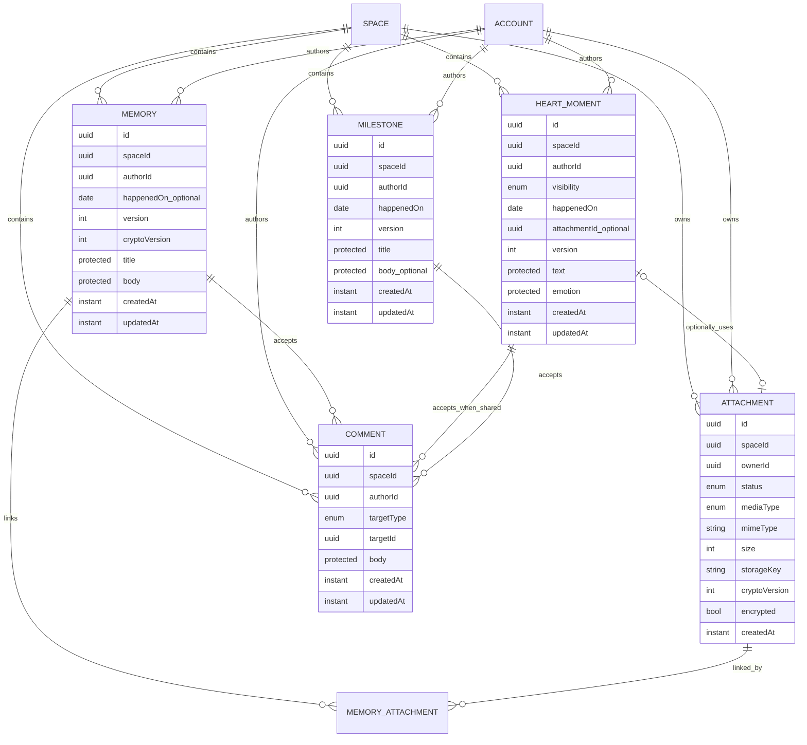

# M2 Domain Model

**Status:** Technischer Entwurf auf Basis der Master-Spezifikation  
**Version:** 1.0

## 1. Modellübersicht



`MEMORY_ATTACHMENT` ist eine technische Relationsskizze, weil Memories mehrere Medien besitzen. Name und konkrete Persistenzform bleiben eine Open-Decision; eine generische Universalrelation ist nicht beabsichtigt.

## 2. Domain-Verträge

### Memory

| Aspekt | Vertrag |
|---|---|
| Privacy | gemeinsamer Space-Inhalt, fachlich `SPACE_SHARED` |
| Autor | unveränderlich oder nur durch explizite Adminmigration; nicht durch normales Update |
| Inhalt | `title`, `body` in ProtectedPayload-Grenze |
| Datum | `happenedOn` optional und getrennt von `createdAt` |
| Medien | mehrere Attachments |
| Schreiben | Autor darf persönlichen Text bearbeiten/löschen |
| Lesen | beide aktiven Space-Partner |
| Story | immer zulässig, sofern nicht gelöscht |
| Suche | serverseitig innerhalb des Space |
| Concurrency | `version`, 409 bei veraltetem Update/Delete |

Offen bleibt, ob bestimmte nicht-inhaltliche Felder von beiden Partnern bearbeitet werden dürfen. Bis zur Entscheidung wird keine weitergehende Schreibberechtigung angenommen.

### HeartMoment

| Aspekt | Vertrag |
|---|---|
| Privacy | `PRIVATE` → `OWNER_ONLY`; `SHARED` → `SPACE_SHARED` |
| Pflichtfelder | Text, Emotion, Sichtbarkeit, `happenedOn` |
| Emotionen | `LOVED`, `SEEN`, `APPRECIATED`, `SUPPORTED`, `GRATEFUL`, `HAPPY` |
| Medien | maximal ein optionales Attachment laut aktuellem Modell |
| Kommentare | nur `SHARED` |
| Story | nur `SHARED` |
| Partnerzugriff bei PRIVATE | niemals – auch nicht indirekt |
| Concurrency | `version`, 409 bei veraltetem Update/Delete/Privacy-Wechsel |

Ein Privacy-Wechsel ist eine Domainoperation, keine reine Clientdarstellung. `PRIVATE` darf nicht zunächst geladen und anschließend im Client herausgefiltert werden.

### Milestone

| Aspekt | Vertrag |
|---|---|
| Privacy | gemeinsamer Space-Inhalt, `SPACE_SHARED` |
| Modell | eigenständige Entität, kein spezieller Listentyp |
| Pflichtfelder | Titel, `happenedOn`, Autor |
| Optional | Body |
| Story | ja |
| Kommentare | ja |
| Spätere Nutzung | Chapter, Suche, Jahresrückblick |
| Concurrency | `version` |

### Attachment

| Aspekt | Vertrag |
|---|---|
| Ownership | genau ein `spaceId`, genau ein `ownerId` |
| Lifecycle | `PENDING → upload → validation → READY`, Fehler `FAILED` |
| Storage | `LocalMediaStore` oder `S3MediaStore` hinter Interface |
| Storage Key | nie aus Benutzerdateiname; UUID-basierter Space-Pfad |
| Metadaten | Typ, MIME, Größe, optionale Breite/Höhe/Dauer, Originalname |
| Crypto | `cryptoVersion`, `encrypted`; Storage setzt Klartext nicht voraus |
| Lesen | nach Membership/Resource-Autorisierung über Streamingroute oder kurzlebige URL |
| Öffentlichkeit | niemals öffentlich |

Attachment-Berechtigung folgt nicht nur dem Attachment selbst, sondern auch der autorisierten Zielressource. Ein Owner-only HeartMoment darf kein Attachment über eine alternative Route an den Partner leaken.

### Comment

| Aspekt | Vertrag |
|---|---|
| Targets | kontrolliertes Enum: `MEMORY`, `MILESTONE`, `HEART_MOMENT` |
| HeartMoment | nur wenn `SHARED` |
| Privacy | erbt Erreichbarkeit der Zielressource; kein eigenständiges Public/Private |
| Autor | darf eigenen Body bearbeiten/löschen, sofern Produktentscheidung bestätigt |
| Event | Kommentar auf fremdem gemeinsamen Inhalt → Domain Event |
| Notification | an Content-Autor, optional Push; keine unnötigen Textpayloads |

Die globale Architektur verlangt Versionsschutz für veränderbare Entitäten; ob Comment explizit `version` erhält, ist vor Implementierung zu bestätigen.

## 3. Privacy-Matrix

| Ressource | Autor | Partner im Space | fremder Space | Story | Suche | Partnerexport | Kommentar |
|---|---:|---:|---:|---:|---:|---:|---:|
| Memory | CRUD | Lesen | niemals | ja | ja | ja | ja |
| HeartMoment SHARED | CRUD | Lesen | niemals | ja | ja | ja | ja |
| HeartMoment PRIVATE | CRUD | niemals | niemals | niemals | nur Owner | niemals | niemals |
| Milestone | CRUD | Lesen | niemals | ja | ja | ja | ja |
| Attachment an Shared-Ziel | gemäß Ziel | gemäß Ziel | niemals | über Ziel | über Ziel | gemäß Ziel | n/a |
| Attachment an Owner-only-Ziel | Owner | niemals | niemals | niemals | niemals für Partner | niemals | n/a |
| Comment | eigener Inhalt | lesen gemäß Ziel | niemals | über Ziel | nur wenn vorgesehen | gemäß Ziel | n/a |

„Partner im Space“ bedeutet aktive Membership im selben Space. Ein Zugriff allein anhand einer Resource-ID ist nie zulässig.

## 4. ProtectedPayload-Grenze

### Metadata

- IDs und Tenant-/Autorreferenzen,
- fachliche Sortierdaten wie `happenedOn`,
- technische Zeitpunkte und `version`,
- `cryptoVersion`,
- für Ableitungen zwingend notwendige, nicht-inhaltliche Zustände.

### ProtectedPayload

- Memory `title` und `body`,
- HeartMoment `text`; Einordnung der Emotion wird explizit entschieden,
- Milestone `title` und `body`,
- Comment `body`,
- weitere sensible Inhaltsfelder.

Version 1 darf Payloads als Klartext speichern, aber Domain-, API-, Persistenz- und Outbox-Grenzen dürfen keinen Klartext als dauerhaft notwendige Form voraussetzen. Diese Bereitschaft ist keine echte E2EE.

## 5. Story Read Model

```text
Memory ───────────────┐
HeartMoment SHARED ───┼── StoryQueryService ── CursorPage<StoryItem>
Milestone ────────────┘

HeartMoment PRIVATE ──X── niemals Teil der Story-Abfrage
```

Story wird nicht persistiert. Jedes Item referenziert sein Original und enthält nur die für Timeline, Autor, Medienvorschau und Navigation notwendigen Daten.

Sortierung:

1. primär `happenedOn`, wenn vorhanden,
2. sonst verbindlich zu entscheidender Fallback,
3. stabiler Tie-Breaker, damit Cursor-Pagination keine Duplikate/Lücken erzeugt.

## 6. Domain Events

| Ereignis | Transaktion | minimale Payload | mögliche Consumer |
|---|---|---|---|
| `MEMORY_CREATED` | mit Memory-Create | IDs, Space, Autor, Zeit; kein Body | Activity, Notification, Rules |
| `MEMORY_UPDATED` | mit Update | IDs, Version, geänderte Kategorien | Cache/Activity |
| `MEMORY_DELETED` | mit Delete | IDs, Löschzeit | Attachment Cleanup, Cache |
| `HEART_MOMENT_CREATED` | mit Create | IDs, Privacy-Klasse, Zeit; kein Text | Activity/Notification nur wenn shared |
| `HEART_MOMENT_VISIBILITY_CHANGED` | mit Wechsel | IDs, alte/neue Klasse | Cache-/Notification-Schutz |
| `MILESTONE_CREATED` | mit Create | IDs, Zeit | Story/Activity |
| `COMMENT_CREATED` | mit Create | Comment-, Target-, Autor-ID | Notification an Content-Autor |
| `ATTACHMENT_READY` | mit Finalisierung | Attachment-ID, sichere Metadaten | Resource/Processing |
| `ATTACHMENT_FAILED` | mit Statuswechsel | ID, sicherer Fehlercode | Cleanup/Observability |

Outbox-Payloads enthalten keine Texte, Originaldateien, Dateinamen oder präzisen privaten Inhalte, sofern kein zwingender und geprüfter Consumer sie benötigt.

## 7. Lösch- und Referenzregeln

- Delete prüft aktuelle `version` und Schreibberechtigung.
- Ein gelöschtes Original verschwindet automatisch aus Story; es gibt keine Story-Kopie.
- Kommentare werden gemäß vorab bestätigter Cascade-/Retention-Regel behandelt.
- Attachments werden erst gelöscht, wenn keine zulässige Referenz mehr besteht und Cleanup-/Retry-Sicherheit geklärt ist.
- Storage-Löschung und DB-Transaktion dürfen nicht als eine unzuverlässige synchrone Operation gekoppelt werden; Cleanup kann über Outbox/Job erfolgen.
- Fehlgeschlagener Storage-Cleanup bleibt beobachtbar und wiederholbar.

## 8. Invarianten

1. Jede Ressource trägt genau einen Space-Kontext.
2. Membership wird vor Ressourcenzugriff geprüft.
3. Owner-only wird in der Datenabfrage durchgesetzt.
4. `PRIVATE` HeartMoment erzeugt keine Partneraktivität, Notification oder Story-Zeile.
5. Attachment-Autorisierung folgt der Zielressource.
6. Veränderbare Entitäten werden nicht ohne Versionsprüfung überschrieben.
7. Story enthält nur Originalreferenzen, keine duplizierten Inhalte.
8. Domainänderung und relevantes Event werden atomar geschrieben.
9. MediaStore und Domain bleiben über Interface getrennt.
10. Keine M2-Struktur setzt echte E2EE voraus oder behauptet sie.

## Verwandte Dokumente

- [API Design](./API-DESIGN.md)
- [Media Pipeline](./MEDIA-PIPELINE.md)
- [Security Test Matrix](./SECURITY-TEST-MATRIX.md)
- [Decision Log](./DECISION-LOG.md)
