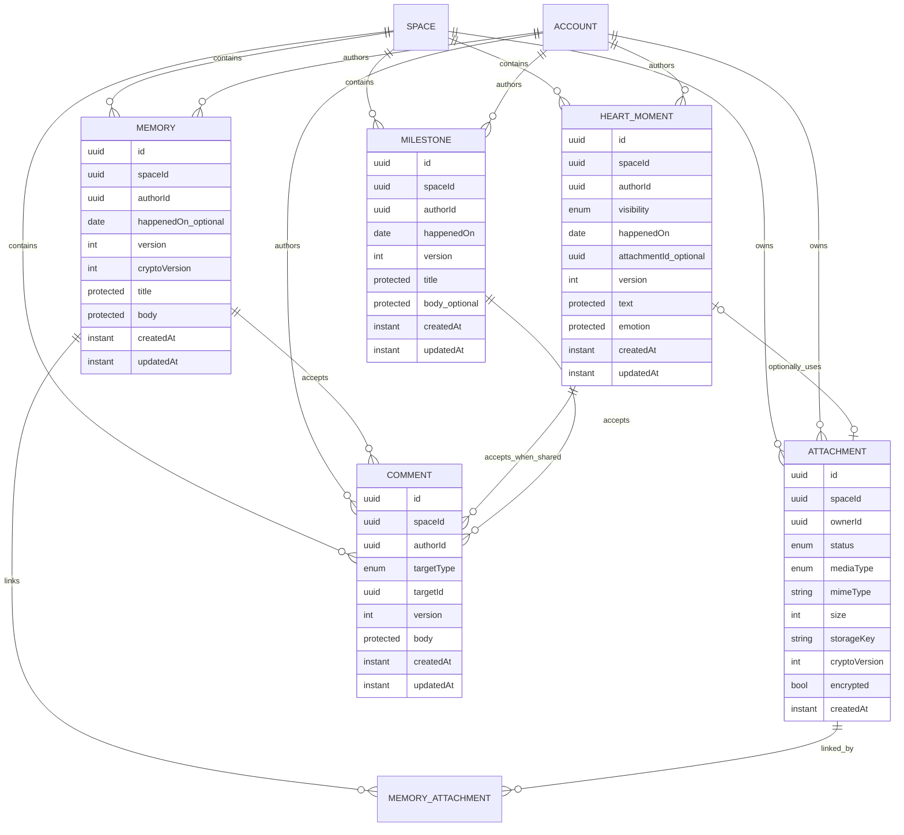

# M2 Domain Model

**Status:** binding domain/privacy design after M2-S0 #68; media/API details remain open until #69/#70  
**Version:** 1.1

## 1. Model overview



`MEMORY_ATTACHMENT` is a technical relation sketch because Memories can contain multiple media items. Its name and concrete persistence form remain an open decision until #69; a generic universal relation is not intended.

## 2. Visibility terminology

The public domain/API language and the internal authorization language are intentionally separate:

| Layer | Values | Contract |
|---|---|---|
| Domain/API | `SHARED`, `PRIVATE` | domain visibility; client value |
| Authorization/persistence | `SPACE_SHARED`, `OWNER_ONLY` | internal access class; not writable as a redundant client value |

`PRIVATE` maps server-side to `OWNER_ONLY`, and `SHARED` to `SPACE_SHARED`. Resources that are always shared by domain definition (Memory, Milestone) need no freely writable visibility field. This separation prevents two competing sources of truth.

## 3. Domain contracts

### Memory

| Aspect | Contract |
|---|---|
| Privacy | shared space content; internally `SPACE_SHARED` |
| Author | derived from Authorization Context on create; immutable afterward |
| Content | `title`, `body` inside ProtectedPayload boundary |
| Date | optional `happenedOn`, separate from `createdAt` |
| Media | multiple attachments; relation becomes binding only after #69 |
| Write | author only; shared readability does not grant partner update/delete authority |
| Read | both active space partners |
| Story | always eligible when not deleted |
| Search | global full-text search not required for G2; M4 scope |
| Concurrency | `version`, 409 on stale update/delete |

Non-content fields follow the same author rule. Future collaborative editing is a new domain feature, not a silent weakening of this invariant.

### HeartMoment

| Aspect | Contract |
|---|---|
| Privacy | domain `PRIVATE` → internal `OWNER_ONLY`; domain `SHARED` → internal `SPACE_SHARED` |
| Required fields | text, emotion, visibility, `happenedOn` |
| Emotions | `LOVED`, `SEEN`, `APPRECIATED`, `SUPPORTED`, `GRATEFUL`, `HAPPY` |
| Emotion classification | ProtectedPayload; not analytics/event/log metadata |
| Media | at most one optional attachment under the current model; media contract #69 |
| Comments | `SHARED` only; delete atomically on `SHARED -> PRIVATE` |
| Story | `SHARED` only |
| Partner access when PRIVATE | never — including indirect paths |
| Concurrency | `version`, 409 on stale update/delete/privacy change |

A privacy change is a domain operation, not merely client presentation. `PRIVATE` must not be loaded first and then filtered out in the client. `SHARED -> PRIVATE` changes the internal class and deletes existing Comments in the same DB transaction; `PRIVATE -> SHARED` does not restore them.

### Milestone

| Aspect | Contract |
|---|---|
| Privacy | shared space content, internally `SPACE_SHARED` |
| Model | distinct entity, not a special list type |
| Required fields | title, `happenedOn`, author |
| Optional | body |
| Author | immutable |
| Story | yes |
| Comments | yes |
| Later use | Chapter, search, annual recap |
| Concurrency | `version` |

The partner write rule is decided by M2-D25: both partners can read, while Update and Delete remain with the immutable author — the same rule as for Memory. Shared readability does not grant write authority. Future collaborative editing requires a new decision and a dedicated rule in `authorization.rules`, not an endpoint exception.

### Attachment

| Aspect | Contract |
|---|---|
| Ownership | exactly one `spaceId`, exactly one `ownerId` |
| Lifecycle | `PENDING → upload → validation → READY`, failure `FAILED`; details #69 |
| Storage | `LocalMediaStore` or `S3MediaStore` behind an interface |
| Storage Key | never derived from user filename; UUID-based space path |
| Metadata | type, MIME, size, optional width/height/duration, original name; privacy/retention details #69 |
| Crypto | `cryptoVersion`, `encrypted`; storage does not assume plaintext |
| Read | after membership/resource authorization through streaming route or short-lived URL |
| Public access | never public |

Attachment authorization follows not only the attachment itself but also the authorized target resource. An owner-only HeartMoment must not leak an attachment to the partner through an alternate route.

### Comment

| Aspect | Contract |
|---|---|
| Targets | controlled enum: `MEMORY`, `MILESTONE`, `HEART_MOMENT` |
| HeartMoment | only when `SHARED` |
| Privacy | inherits target reachability; no independent public/private state |
| Author | immutable; only author may edit/delete own body |
| Concurrency | persisted `version`; Update/Delete with If-Match, stale → 409 |
| Parent delete | Comments are deleted atomically with parent as dependent domain objects |
| HeartMoment becomes private | existing Comments are deleted atomically |
| Event | comment on another person's shared content → Domain Event without body |
| Notification | to content author, optional Push; no unnecessary text payloads |

Server-side parent cascade/privacy operations may remove dependent Comments independently of the Comment author; they are not user edit operations and do not require If-Match supplied by the Comment author.

## 4. Privacy matrix

| Resource | Author | Partner in space | Foreign space | Story | Search | Partner export | Comment |
|---|---:|---:|---:|---:|---:|---:|---:|
| Memory | CRUD | Read | never | yes | later M4 | yes | yes |
| HeartMoment SHARED | CRUD | Read | never | yes | later M4 | yes | yes |
| HeartMoment PRIVATE | CRUD | never | never | never | owner only, if later offered | never | never |
| Milestone | CRUD* | Read | never | yes | later M4 | yes | yes |
| Attachment on shared target | according to target | according to target | never | through target | through target | according to target | n/a |
| Attachment on owner-only target | Owner | never | never | never | never for partner | never | n/a |
| Comment | own content CRUD | read according to target | never | through target | not G2 | according to target | n/a |

`*` Milestone partner write permission is confirmed separately before its runtime slice; until then, author-only is the safe default assumption.

“Partner in space” means active membership in the same space. Access based solely on a resource ID is never allowed.

## 5. ProtectedPayload boundary

### Metadata

- IDs and tenant/author references,
- domain sort data such as `happenedOn`,
- technical timestamps and `version`,
- `cryptoVersion`,
- non-content states strictly required for derivations.

### ProtectedPayload

- Memory `title` and `body`,
- HeartMoment `text` and `emotion`,
- Milestone `title` and `body`,
- Comment `body`,
- additional sensitive content fields.

Version 1 may store payloads as plaintext, but domain, API, persistence, and Outbox boundaries must not require plaintext as their permanent form. This readiness is not real E2EE.

ProtectedPayload is not duplicated into analytics, log fields, metric labels, notification previews, or Domain Event payloads. Authorized resource responses may of course return content after successful authorization.

## 6. Story Read Model

```text
Memory ───────────────┐
HeartMoment SHARED ───┼── StoryQueryService ── CursorPage<StoryItem>
Milestone ────────────┘

HeartMoment PRIVATE ──X── never part of the Story query
```

Story is not persisted. Every item references its original and contains only the data required for timeline, author, media preview, and navigation.

Sorting and cursor behavior are decided authoritatively in #70 / M2-D08. Global full-text search `q` is not part of the G2 minimum requirement and generally remains M4.

## 7. Domain Events

Every M2 event uses at least:

```text
eventId
eventType
occurredAt
spaceId
actorId
resourceType
resourceId
resourceVersion
```

Event-specific extensions may contain only additional IDs, technical timestamps, and explicitly safe states/categories. ProtectedPayload, Comment body, HeartMoment emotion, original filename, storage key, and download URL are forbidden.

| Event | Transaction | Additional safe payload | Possible consumers |
|---|---|---|---|
| `MEMORY_CREATED` | with Memory create | no content fields | Activity, Rules |
| `MEMORY_UPDATED` | with Update | optional changed safe categories | Cache/Activity |
| `MEMORY_DELETED` | with Delete | `deletedAt` | Attachment Cleanup, Cache |
| `HEART_MOMENT_CREATED` | with Create | visibility/privacy state; no text/emotion | Activity/Notification only if shared |
| `HEART_MOMENT_VISIBILITY_CHANGED` | with change | old/new visibility | Cache/Notification protection |
| `MILESTONE_CREATED` | with Create | no content fields | Story/Activity |
| `COMMENT_CREATED` | with Create | target type/ID | Notification to content author |
| `ATTACHMENT_READY` | with finalization | safe technical metadata according to #69 | Resource/Processing |
| `ATTACHMENT_FAILED` | with state change | safe error code | Cleanup/Observability |

Consumers that need presentation load it under their own authorization or use generic text. Outbox is not a shadow copy of sensitive content.

## 8. Deletion and reference rules

- User-initiated Updates/Deletes check current `version` and write permission.
- Domain delete makes the resource invisible immediately when the commit succeeds.
- A deleted original disappears automatically from Story; there is no Story copy.
- Comments are deleted atomically in the same DB transaction on parent delete.
- Comments are also deleted atomically on HeartMoment `SHARED -> PRIVATE`.
- Domain Events/audit may retain technical IDs/states, but no ProtectedPayload.
- Attachments/blobs are physically deleted only under the reference/retention/cleanup rules defined in #69.
- Storage deletion and DB transaction are not coupled into one unreliable synchronous operation; cleanup may happen through Outbox/job processing.
- Failed storage cleanup remains observable and retryable without making the deleted domain resource visible again.

## 9. Invariants

1. Every resource carries exactly one space context.
2. Membership is checked before resource access.
3. Owner-only is enforced in the data query.
4. `PRIVATE` HeartMoment creates no partner activity, notification, or Story row.
5. Attachment authorization follows the target resource.
6. Mutable entities are not overwritten without version checking.
7. Story contains original references only, not duplicated content.
8. Domain change and relevant event are written atomically.
9. MediaStore and domain remain separated by an interface.
10. No M2 structure requires or claims real E2EE.
11. Shared readability does not automatically grant write permission.
12. `authorId`/`ownerId` are not transferred by normal updates.
13. `visibility` is the domain API source of truth; internal `privacyClass` is not a second client source of truth.
14. ProtectedPayload is not duplicated into events, logs, analytics, or metric labels.

## Related documents

- [API Design](./API-DESIGN.md)
- [Media Pipeline](./MEDIA-PIPELINE.md)
- [Security Test Matrix](./SECURITY-TEST-MATRIX.md)
- [Decision Log](./DECISION-LOG.md)
- [Project Control](./PROJECT-CONTROL.md)
