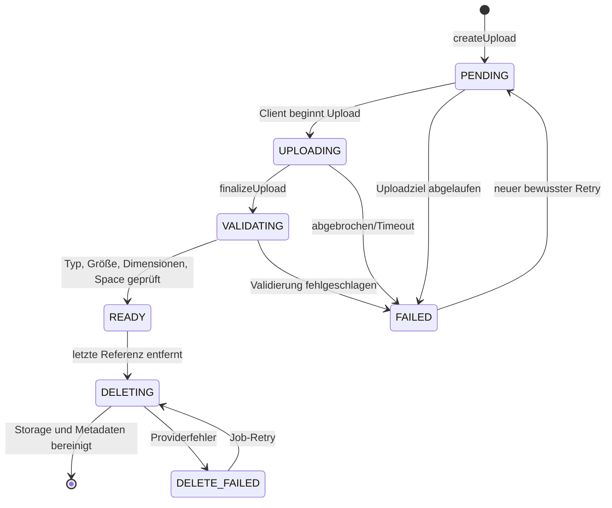
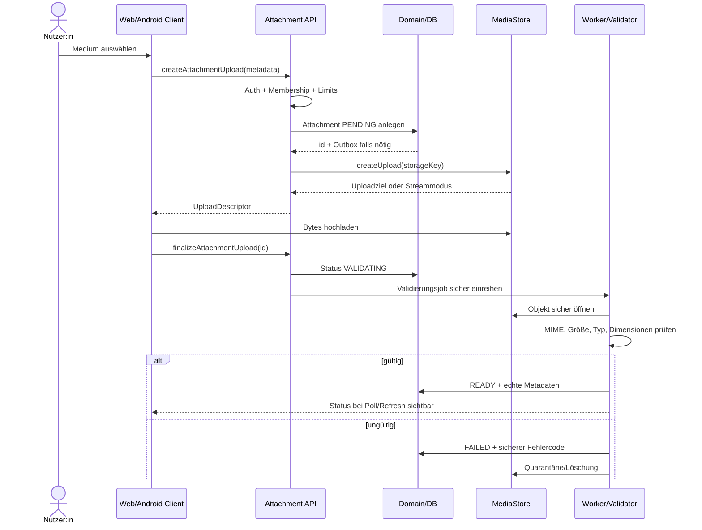

# M2 Media Pipeline

**Status:** Technischer Ablaufentwurf  
**Version:** 1.0

Ziel ist ein sicherer, adapterunabhängiger Medienfluss für LocalMediaStore und S3MediaStore. Cloud-Medien sind nie öffentlich; lokale Dateipfade und Storage Keys werden nicht zu Autorisierungsmechanismen.

## 1. Lifecycle



Die Master-Spezifikation nennt `PENDING → upload → validation → READY`, Fehler `FAILED`. `UPLOADING`, `VALIDATING`, `DELETING` und `DELETE_FAILED` sind technische Zustandsvorschläge und müssen vor Persistenz im Decision Log bestätigt werden.

## 2. Komponenten

```text
Client
  │  createUpload / finalize / read
  ▼
Attachment API
  │  Membership + Resource Authorization
  ▼
Attachment Service ─────── Attachment Repository
  │                              │
  ▼                              └── Outbox / Job
MediaStore Interface                    │
  ├── LocalMediaStore                   └── validation / cleanup / processing
  └── S3MediaStore
```

Interface sinngemäß laut Master-Spezifikation:

```text
createUpload()
finalizeUpload()
open()
delete()
createReadUrl()
```

Domaincode kennt keinen Bucket, lokalen Pfad oder konkreten Cloudanbieter.

## 3. Upload-Sequenz



Wenn LocalMediaStore synchron validieren kann, darf die Implementierung kürzer sein. Die beobachtbaren Zustände und Sicherheitsprüfungen bleiben gleich.

## 4. Storage Key

Verbindliches Muster:

```text
spaces/{spaceUuid}/attachments/{attachmentUuid}/original
```

- Kein Benutzerdateiname im Key.
- Keine hochzählbare ID.
- Kein MIME-Type oder Privacy-Text im Pfad.
- Varianten/Thumbnails erhalten kontrollierte, serverseitige Suffixe.
- `originalName` ist reine Metadaten und wird nie für Pfad, Autorisierung oder Content-Type vertraut.

## 5. Validierung

### Immer serverseitig prüfen

- tatsächlichen MIME-Type/Magic Bytes,
- tatsächlich gespeicherte Größe,
- erlaubte Medienkategorie,
- Bilddimensionen,
- Videodauer, falls unterstützt,
- Space-Zuordnung,
- Owner-/Zielberechtigung,
- Uploadvollständigkeit,
- Provider-/Objektintegrität.

### Vor Implementierung festlegen

- erlaubte MIME-/Medientypen,
- maximale Einzelgröße,
- maximale Gesamtzahl/Größe je Memory,
- Dimensions-/Megapixelgrenze,
- unterstützte Videodauer/Codecs,
- Umgang mit EXIF und Standortmetadaten,
- Malware-/Content-Scanstrategie,
- Thumbnail-/Transcodingstrategie,
- Quarantäne- und Retention-Zeiten.

Der vom Client gemeldete `Content-Type` dient nur als Erwartung, nie als Vertrauensquelle.

## 6. Autorisierung

Attachmentzugriff wird in zwei Stufen geprüft:

1. aktive Membership im `spaceId`,
2. Zugriff auf eine zulässige Zielressource oder einen noch nicht verknüpften eigenen Upload.

```text
Account B fragt Attachment X an
  ├── Membership in Space?             nein → 404/401 gemäß Kontext
  ├── Attachment gehört zu Space?      nein → 404
  ├── Zielressource erreichbar?         nein → 404
  ├── Ziel OWNER_ONLY von Account A?   ja   → 404
  └── sichere Read URL/Stream          erlaubt
```

- Ein Attachment darf nicht allein über seine ID gelesen werden.
- Eine frühere Shared-Verknüpfung berechtigt nicht weiter, wenn die Zielressource private wird.
- Unverknüpfte PENDING-Uploads sind nur für Owner und nur begrenzte Zeit erreichbar.
- Ein Attachment, das an mehrere Ziele gebunden werden darf, benötigt eine explizite Berechtigungs- und Cleanup-Regel.

## 7. Read Access

Zwei zulässige Adaptermuster:

### Autorisierte Streamingroute

- API prüft jeden Zugriff,
- API/MediaStore streamt Bytes,
- geeignet für LocalMediaStore und einfache Self-Hosted-Installationen,
- Range Requests, Content-Type, Cache-Header und Downloadname werden kontrolliert.

### Kurzlebige signierte URL

- API prüft zuerst Membership und Zielressource,
- URL besitzt kurze Laufzeit und minimalen Scope,
- Bucket bleibt nicht öffentlich,
- URL wird nicht in Analytics, Logs, Referrer oder dauerhaften Clientcaches gespeichert,
- Ablauf und erneute Ausstellung sind getestet.

## 8. Verknüpfung mit Domainressourcen

### Memory

- mehrere Attachments,
- Reihenfolge/Galerie benötigt explizites Relationsfeld,
- nur READY-Attachments werden regulär dargestellt,
- partieller Uploadfehler lässt Memory-Entwurf kontrolliert bestehen.

### HeartMoment

- aktuell maximal ein optionales Attachment,
- Attachment erbt `OWNER_ONLY` oder `SPACE_SHARED` der Zielressource,
- Privacy-Wechsel invalidiert bestehende Read Descriptors/Caches.

### Milestone/Comment

- Attachment-Unterstützung ist in der aktuellen M2-Spezifikation nicht vorgesehen und wird nicht still ergänzt.

## 9. Finalisierung und Idempotenz

- `finalizeUpload` darf bei Wiederholung keinen zweiten Attachmentdatensatz oder doppelten Job erzeugen.
- READY bleibt READY bei identischer Wiederholung.
- FAILED benötigt bewussten Retry mit neuem/erneuertem Uploadziel.
- Zwei parallele Finalisierungen ergeben genau einen wirksamen Validierungslauf oder idempotent dasselbe Ergebnis.
- Ein abgelaufenes Uploadziel kann nicht durch Clientzeit verlängert werden.

## 10. Delete und Orphan Cleanup

```text
Domain-Relation entfernt
  │
  ├── weitere zulässige Referenzen? → Attachment bleibt
  │
  └── keine Referenz
        ├── DB markiert Cleanup atomar
        ├── Outbox/Job löscht Providerobjekt
        └── Erfolg löscht/finalisiert Metadaten
```

- Providerlöschung erfolgt retry-fähig.
- DB-Commit wird nicht zurückgerollt, nur weil ein externer Storage temporär nicht antwortet.
- PENDING/FAILED-Orphans erhalten eine definierte Retention.
- Cleanup-Logs enthalten Attachment-ID/Status, aber keine Dateiinhalte oder signierten URLs.

## 11. Crypto Readiness

Attachment trägt:

- `cryptoVersion`,
- `encrypted`.

MediaStore behandelt Bytes als opak. Keine Adapterlogik darf voraussetzen, dass Server oder Worker immer Klartext lesen können. In Version 1 ist echte E2EE nicht aktiv; Scans/Thumbnails können Klartext benötigen. Diese spätere Inkompatibilität wird dokumentiert und nicht als bereits gelöst dargestellt.

## 12. Fehler- und Retryverhalten

| Fehler | Status | Clientaktion |
|---|---|---|
| Typ nicht erlaubt | FAILED | Datei ersetzen |
| zu groß | FAILED | kleinere Datei wählen |
| Dimensionen ungültig | FAILED | Datei ersetzen |
| Uploadziel abgelaufen | PENDING/FAILED | neues Ziel anfordern |
| Netzwerkabbruch | PENDING/FAILED | bewusster Retry |
| Validierung läuft | VALIDATING | Status anzeigen/pollen |
| Provider temporär nicht erreichbar | unverändert + Retryjob | nicht als Erfolg anzeigen |
| nicht autorisiert | neutrales 404 | keine Existenz bestätigen |
| Zielressource gelöscht/private | Zugriff entzogen | URL/Cache invalidieren |

Android besitzt im MVP keine Offline-Upload-Outbox. Ohne Verbindung wird kein Domain- oder Uploaderfolg suggeriert.

## 13. Observability ohne Leak

Erlaubt:

- Attachment-ID,
- Space-/Accountreferenz gemäß Logging-Policy,
- Adaptername,
- Statusübergang,
- Byteklasse statt unnötig genauer privater Metrik,
- Dauer,
- sicherer Fehlercode,
- Jobversuche.

Nicht loggen:

- signierte URL,
- Originaldateiname, wenn nicht zwingend für geprüften Support,
- EXIF-/Standortdaten,
- Bild-/Videoinhalt,
- Authorization Header,
- Storage Credentials,
- vollständige Providerantworten mit sensiblen Daten.

## 14. Abnahmekriterien

- LocalMediaStore und S3MediaStore bestehen dieselben Contract-Tests.
- Upload-Lifecycle ist idempotent und race-sicher.
- Typ, Größe, Dimensionen und Space werden serverseitig geprüft.
- Cross-Tenant- und Owner-only-Abruf liefern keine Leaks.
- signierte URLs sind kurzlebig und nicht wiederverwendbar über ihre Gültigkeit hinaus.
- Orphans und fehlgeschlagene Deletes werden retry-fähig bereinigt.
- Memory-Galerie und HeartMoment-Attachment respektieren ihre Kardinalität.
- Logs, Analytics und Events enthalten keine Medieninhalte.
- Offline-Write wird nicht vorgetäuscht.

## Verwandte Dokumente

- [Domain Model](./DOMAIN-MODEL.md)
- [API Design](./API-DESIGN.md)
- [Security Test Matrix](./SECURITY-TEST-MATRIX.md)
- [Decision Log](./DECISION-LOG.md)
