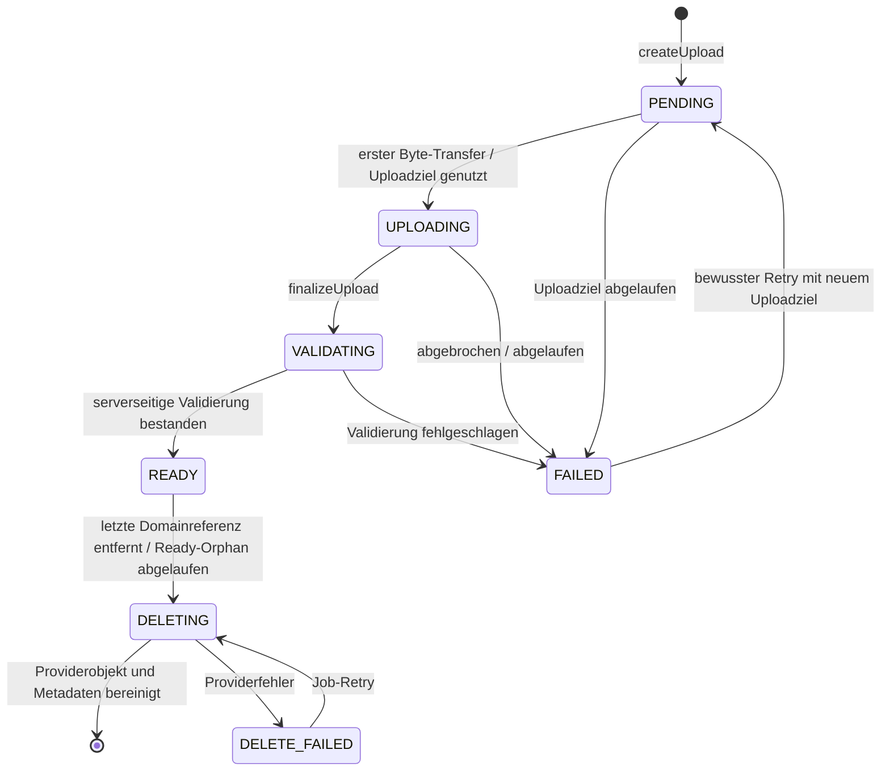

# M2 Media Pipeline

**Status:** Verbindlicher M2-S0 Media-Vertrag nach #69, ergänzt um M2-D14/D15 nach #78, M2-D23 nach #85 und Video-Slice #88  
**Version:** 1.4

Ziel ist ein sicherer, adapterunabhängiger Medienfluss für LocalMediaStore und S3MediaStore. Cloud-Medien sind nie öffentlich; lokale Dateipfade und Storage Keys werden nicht zu Autorisierungsmechanismen.

## 1. Verbindlicher Lifecycle



`PENDING`, `UPLOADING`, `VALIDATING`, `READY`, `FAILED`, `DELETING` und `DELETE_FAILED` sind verbindliche interne Zustände. Clients dürfen `UPLOADING`, `VALIDATING`, `DELETING` und `DELETE_FAILED` auf stabilere öffentliche Zustände/Progressdarstellung abbilden; sie dürfen daraus keine zusätzlichen Schreibrechte ableiten.

`finalizeUpload` ist idempotent. Zwei parallele Finalize-Requests dürfen genau einen wirksamen Validierungslauf erzeugen. Statuswechsel werden mit Row Lock bzw. bestehender Serialisierungskonvention geschützt.

## 2. Attachment-Bindung

M2 verwendet **exklusive Attachment-Ownership pro Domainziel**:

- Ein Attachment gehört genau einem `spaceId` und einem unveränderlichen `ownerId`.
- Ein `READY` Attachment darf höchstens an **eine** Domainressource gebunden sein.
- Wiederverwendung desselben Attachment-Datensatzes an mehreren Parents ist in M2 verboten. Soll dasselbe Medium an mehreren Stellen erscheinen, entsteht ein neuer Attachment-Datensatz/Upload; Content-Deduplication ist kein M2-Feature.
- Memory besitzt eine explizite Relation `MemoryAttachment` mit `memoryId`, `attachmentId`, `position`.
- `position` ist innerhalb einer Memory eindeutig, nullbasiert und wird serverseitig validiert; normale Darstellung sortiert aufsteigend nach `position`, danach stabil nach Attachment-ID.
- HeartMoment besitzt maximal ein Attachment; die konkrete Persistenz darf FK oder Relation sein, muss aber dieselben Autorisierungs-/Cleanup-Regeln erfüllen.
- Cross-Space-Bindung ist immer verboten.
- Ein Attachment darf nur vom eigenen Owner gebunden werden. Die Zielressource muss für diesen Account schreibbar sein.
- Nach erfolgreicher Bindung folgt die Leseberechtigung ausschließlich dem Parent. Attachment-Owner allein ist kein alternativer Lesepfad für einen Parent, den er nicht mehr lesen darf.

Diese exklusive Bindung macht Cleanup und Privacy deterministisch und vermeidet eine implizite Many-to-Many-Autorisierung.

## 3. Komponenten

```text
Client
  │  createUpload / finalize / bind / read
  ▼
Attachment API
  │  Membership + Resource Authorization
  ▼
Attachment Service ─────── Attachment Repository
  │                              │
  ▼                              └── Outbox / Job
MediaStore Interface                    │
  ├── LocalMediaStore                   └── validation / cleanup
  └── S3MediaStore
```

Domaincode kennt keinen Bucket, lokalen Pfad oder konkreten Cloudanbieter.

## 4. Upload-Transport

Ein Domainvertrag, zwei zulässige Adaptertransporte:

### LocalMediaStore

- Bytes laufen über eine autorisierte serverseitige Streaming-Uploadroute.
- Request ist an Account, Space und Attachment-ID gebunden.
- Server erzwingt Streaming-Byte-Limit; kein vollständiges unlimitiertes Puffern im RAM.

### S3MediaStore

- `createUpload` darf eine kurzlebige presigned Upload-URL ausstellen.
- TTL: **10 Minuten**.
- URL ist an exakt einen servergenerierten Storage Key gebunden und erlaubt keinen frei wählbaren Bucket/Key.
- Bucket bleibt privat; Public ACLs sind verboten.
- Presigned URL, Signatur und Credentials werden nicht geloggt oder dauerhaft im Client gespeichert.
- Vor der serverseitigen Verarbeitung wird die Objektgröße per `HEAD`/`Content-Length` geprüft.
- Der anschließende GET wird streamend konsumiert; Validierung kopiert höchstens das Medienlimit plus ein Prüfbyte. Eine Abweichung zwischen HEAD-Größe und tatsächlich gelesener Größe scheitert fail-closed.

Für beide Adapter bleiben `createUpload`, `finalizeUpload`, Autorisierung, Statusautomat und Validierungsentscheidung serverkontrolliert. Ein erfolgreicher Providerupload ist niemals gleichbedeutend mit `READY`.

## 5. Storage Key

Verbindliches Muster:

```text
spaces/{spaceUuid}/attachments/{attachmentUuid}/original
```

- Kein Benutzerdateiname im Key.
- Keine hochzählbare ID.
- Kein MIME-Type oder Privacy-Text im Pfad.
- Varianten erhalten nur kontrollierte serverseitige Suffixe.
- `originalName` ist reine Protected-/Support-Metadaten und wird nie für Pfad, Autorisierung oder Content-Type vertraut.

## 6. Verbindliche M2-Medienlimits

M2 unterstützt bewusst eine kleine Positivliste:

| Kategorie | MIME | Max. Einzelgröße | weitere Grenze |
|---|---|---:|---|
| JPEG | `image/jpeg` | 25 MiB | max. 40 MP, max. 12.000 px je Kante |
| PNG | `image/png` | 25 MiB | max. 40 MP, max. 12.000 px je Kante |
| WebP | `image/webp` | 25 MiB | max. 40 MP, max. 12.000 px je Kante |
| HEIC/HEIF | `image/heic`, `image/heif` | 25 MiB | max. 40 MP, max. 12.000 px je Kante |
| MP4 Video | `video/mp4` | 250 MiB | max. 180 s, max. 3840×2160 |
| QuickTime Video | `video/quicktime` | 250 MiB | max. 180 s, max. 3840×2160 |

Weitere Formate, Audio-only, RAW, GIF-Animation, MKV/WebM und Dokumente sind nicht Teil des M2-Vertrags und werden fail-closed abgewiesen, bis sie explizit freigegeben werden.

> **Lieferstand (M2-D23 / #88):** Bild- und Videozeilen dieser Tabelle sind serverseitig implementiert. MP4 und QuickTime werden anhand des gespeicherten Objekts validiert, per Stream-Copy bereinigt und erneut geprüft. `SBS_FFMPEG_ENABLED=false` kann Video für eine Installation fail-closed deaktivieren, ohne Bilder oder den übrigen Dienst abzuschalten.

Zusätzlich:

- Memory: maximal **20 Attachments** und maximal **500 MiB deklarierte/validierte Gesamtgröße**.
- HeartMoment: maximal **1 Attachment**.
- Serverwerte sind verbindlich; Clientlimits dienen nur UX.
- Größe wird aus dem tatsächlich gespeicherten Objekt bestimmt, nicht aus Clientmetadata.
- Bilddimensionen sowie Videodauer und Videoauflösung werden aus serverseitig erkannten Medieninformationen bestimmt.
- Deklarierter MIME, Dateiendung und Originalname sind keine Vertrauensquelle.

## 7. Validierung

Validierung erfolgt **asynchron nach `finalizeUpload`** über den bestehenden Job-/Outbox-Stil. `finalizeUpload` setzt atomar `VALIDATING` und reiht genau einen idempotenten Validierungsjob ein; der Client pollt/refresh't den Status.

Serverseitig prüfen:

1. Objekt existiert exakt am servergenerierten Key.
2. tatsächliche Größe innerhalb Limit.
3. Magic Bytes / erkannter MIME sind in der Allowlist und kompatibel mit erwarteter Kategorie.
4. Bilddimensionen/Megapixel bzw. Videodauer/Auflösung innerhalb Limit.
5. Parser kann das Medium unter Ressourcenlimits sicher öffnen.
6. Attachment gehört zum erwarteten Space/Owner und Statusübergang ist zulässig.
7. Provider-/Objektintegrität ist ausreichend für den Adapter bestätigt.
8. Metadaten-Allowlist wird extrahiert und das Objekt anschließend bereinigt gespeichert (M2-D14).

Erst nach allen acht Schritten wird `READY` gesetzt. Ein Providerupload oder eine bestandene Formatprüfung allein bedeuten kein `READY`.

Video wird zusätzlich nach dem Stream-Copy-Remux erneut mit ffprobe geprüft. Der Video-Slice übernimmt genau einen primären Videostream und optional einen primären Audiostream; Transcoding findet nicht statt. Unbekannte verbleibende Metadaten oder nicht erlaubte Streams machen die Bereinigung ungültig. Die verbindlichen ffmpeg-/ffprobe-Ressourcenlimits und Supply-Chain-Regeln stehen in [`VIDEO-PROCESSING.md`](./VIDEO-PROCESSING.md).

Die Erzeugung der abgeleiteten Variante (M2-D15) folgt danach und gehört bewusst **nicht** zu dieser Kette: ihr Fehlschlag führt nicht zu `FAILED`, siehe Abschnitt 7.2.

Bei Fehler: `FAILED` mit einem stabilen, nicht sensitiven Fehlercode; Objekt wird für Cleanup markiert. Parserfehler oder unbekannte Typen führen fail-closed zu `FAILED`.

Ein Malware-Scanner ist für M2 nicht als universelle Sicherheitsgarantie definiert. Uploads werden ausschließlich als Medien behandelt und nie serverseitig ausgeführt. Eine spätere AV-/Content-Scan-Erweiterung darf den Statusautomaten erweitern, aber `READY` weiterhin erst nach allen verpflichtenden Prüfungen setzen.

### 7.1 Metadaten-Entfernung (M2-D14)

Vor dem Strippen wird genau diese Allowlist extrahiert und als ProtectedPayload abgelegt:

| Feld | Zweck |
|---|---|
| Aufnahmezeitpunkt | Vorschlagsquelle für `happenedOn` |
| Orientierung | korrekte Darstellung ohne Neucodierung im Client |
| Breite, Höhe | bereits für die Limitprüfung ermittelt |
| Dauer (nur Video) | bereits für die Limitprüfung ermittelt |

Alles Übrige wird verworfen: GPS und sonstige Standortangaben, Geräte- und Seriennummern, Software-, Autor- und Copyrightfelder, Kommentar- und Beschreibungsfelder, im Container eingebettete Vorschaubilder sowie **jedes nicht aufgeführte oder unbekannte Segment**. Die Regel ist eine Allowlist, keine Blacklist bekannter Standortfelder — Container transportieren Position auch in herstellereigenen und künftig hinzukommenden Segmenten.

Gespeichert wird ausschließlich die bereinigte Datei. Die hochgeladenen Originalbytes werden nicht dauerhaft aufbewahrt; es gibt in M2 keinen Pfad, der ein Medium mit eingebetteten Metadaten ausliefert. Ein Medium, das nicht sicher bereinigt werden kann, wird fail-closed `FAILED` und niemals ungestrippt gespeichert.

Bei Video wird ein neuer MP4-/QuickTime-Container per Stream-Copy aufgebaut, Metadaten- und Chapter-Mapping deaktiviert und nur die erlaubten primären Streams übernommen. Nach dem Remux wird erneut geprobt. GPS-/Location-Metadaten dürfen weder im `READY`-Video noch im Poster verbleiben.

Die extrahierte Allowlist ist ProtectedPayload und wird nicht in API-Metadaten außerhalb des Parent-Kontexts, Logs, Events, Metriken oder Suchindizes projiziert.

### 7.2 Abgeleitete Varianten (M2-D15)

M2 erzeugt je Attachment höchstens **eine** Variante:

| Kategorie | Variante | Lieferstand |
|---|---|---|
| Bild | verkleinertes Thumbnail | erster Media-Slice |
| Video | einzelner Posterframe | geliefert mit #88 |

Transcoding, mehrere Auflösungsstufen, Audioextraktion und adaptives Streaming sind **nicht** Teil von M2.

Der vorhandene serverkontrollierte Variantenslot `thumbnail` ist die einzige Still-Variante: bei Bildern enthält er das Thumbnail, bei Videos den Posterframe. Es gibt kein separates `hasPoster`, keinen zweiten Varianten-Key und keine zweite ACL.

- Varianten entstehen serverseitig im selben Validierungsjob, **nach** Anwendung von M2-D14, und tragen daher selbst keine eingebetteten Metadaten.
- Eine Variante besitzt keine eigene Autorisierung. Sie folgt exakt der ihres Attachments und damit dem Parent; ein Privacy-Wechsel des Parents sperrt auch die Variante.
- Clients wählen keine Varianten-Keys. Der Server benennt Varianten über kontrollierte Suffixe nach dem Muster aus Abschnitt 5.
- Schlägt die Variantenerzeugung fehl, bleibt das Attachment nutzbar und wird ohne Variante ausgeliefert. Ein fehlendes Thumbnail/Poster ist ein Darstellungs-, kein Sicherheitsproblem und setzt das Attachment nicht `FAILED`.
- Cleanup entfernt Varianten gemeinsam mit dem Attachment. Ein verwaistes Variantenobjekt ist ein Cleanup-Fehler, kein zulässiger Zustand.

## 8. Autorisierung

Attachmentzugriff wird in zwei Stufen geprüft:

1. aktive Membership im `spaceId`,
2. Zugriff auf die zulässige Zielressource oder einen noch nicht verknüpften eigenen Upload innerhalb seines Bindungsfensters.

```text
Account B fragt Attachment X an
  ├── Membership in Space?             nein → 404/401 gemäß Kontext
  ├── Attachment gehört zu Space?      nein → 404
  ├── gebunden?
  │     ├── ja: Zielressource erreichbar? nein → 404
  │     └── nein: Owner + Bindungsfenster? nein → 404
  ├── Ziel OWNER_ONLY von Account A?   ja → 404
  └── sichere Read URL/Stream          erlaubt
```

- Ein Attachment darf nicht allein über seine ID gelesen werden.
- Eine frühere Shared-Verknüpfung berechtigt nicht weiter, wenn die Zielressource private wird.
- PENDING/UPLOADING/VALIDATING/FAILED sind nur für den Owner verwaltbar und nicht als regulärer Parent-Inhalt lesbar.
- READY ohne Parent ist nur für den Owner innerhalb des Bindungsfensters sichtbar.
- Bindung und Parent-Autorisierung erfolgen in einer DB-Transaktion mit Race-Schutz.

## 9. Read Access

### LocalMediaStore: autorisierte Streamingroute

- API prüft jeden Zugriff unmittelbar vor `open()`.
- Range Requests, Content-Type, Cache-Header und Downloadname werden serverseitig kontrolliert.
- keine Dateisystempfade im Response.

### S3MediaStore: kurzlebige signierte Read URL

- API prüft unmittelbar vorher Membership und Parent.
- TTL: **5 Minuten**.
- URL besitzt minimalen Scope auf genau ein Objekt.
- Bucket bleibt privat.
- URL wird nicht in Analytics, Logs, Referrer oder dauerhaften Clientcaches gespeichert.
- Nach Membership-/Privacy-Entzug kann eine bereits ausgestellte URL technisch höchstens bis TTL-Ende gültig bleiben; diese begrenzte Restzeit ist akzeptierter M2-Adapter-Trade-off und wird mit 5 Minuten minimiert.

## 10. READY-Bindungsfenster

Ein Attachment darf nach erfolgreicher Validierung vorübergehend `READY` und noch ungebunden sein, damit Upload und Parent-Mutation entkoppelt bleiben.

- Bindungsfenster: **60 Minuten ab `readyAt`**.
- Innerhalb dieses Fensters darf nur der Owner das Attachment an einen zulässigen Parent im selben Space binden.
- Nach Bindung entfällt die Orphan-Frist; Lebensdauer folgt dem Parent.
- Ungebundenes READY nach 60 Minuten wird atomar `DELETING` markiert und vom Cleanup entfernt.
- Ein Bind-Versuch parallel zum Cleanup wird über Row Lock/Statusprüfung serialisiert: entweder Bind gewinnt vollständig oder Cleanup; kein gebundener Blob darf gelöscht werden.

## 11. Retention und Cleanup

| Zustand / Anlass | Retention | Aktion |
|---|---:|---|
| PENDING ohne Upload/Finalize | 24 h ab `createdAt` | `DELETING` + Cleanup |
| UPLOADING ohne Finalize | 24 h ab letzter serverbekannter Aktivität, sonst `createdAt` | `DELETING` + Cleanup |
| FAILED | 24 h ab `failedAt` | `DELETING` + Cleanup |
| READY ungebunden | 60 min ab `readyAt` | `DELETING` + Cleanup |
| letzte Parent-Referenz entfernt / Parent gelöscht | sofort fachlich unreferenziert | `DELETING` atomar markieren; Providercleanup async |
| DELETE_FAILED | kein automatisches Vergessen | exponentieller Retry + Alarm/Metrik bis Erfolg oder manueller Eingriff |

Cleanup entfernt Original und abgeleitete Variante gemeinsam. Er läuft mindestens **stündlich** und ist idempotent. Produktionsbetrieb benötigt Metriken für Anzahl/Alter von PENDING, FAILED, ungebunden READY und DELETE_FAILED sowie Cleanup-Erfolg/-Fehler. Keine Metrik enthält Dateinamen oder ProtectedPayload.

Providerlöschung erfolgt außerhalb der fachlichen DB-Transaktion. Ein Storagefehler darf einen bereits gelöschten/private gewordenen Parent nicht wieder sichtbar machen.

## 12. Verknüpfung mit Domainressourcen

### Memory

- mehrere Attachments über `MemoryAttachment(position)`,
- maximal 20 / 500 MiB,
- nur READY innerhalb Bindungsfenster bindbar,
- Relation und Statusprüfung atomar,
- partieller Uploadfehler verändert bestehende Memory nicht automatisch.

### HeartMoment

- maximal ein optionales Attachment,
- Attachment folgt der Parent-Autorisierung,
- Privacy-Wechsel invalidiert neue Read-Descriptor-Ausstellung; bestehende S3-Read-URL kann höchstens ihre 5-Minuten-TTL auslaufen.

### Milestone/Comment

Attachment-Unterstützung ist in M2 nicht vorgesehen und wird nicht still ergänzt.

## 13. Idempotenz und Concurrency

- `createUpload` mit demselben Idempotency-Key erzeugt höchstens ein Attachment.
- `finalizeUpload` ist idempotent; READY bleibt READY, FAILED benötigt bewussten Retry.
- Retry aus FAILED erzeugt ein neues Uploadziel für denselben Attachment-Datensatz nur solange keine Bindung existiert; Status/Versuch werden serverseitig versioniert/serialisiert.
- Parent-Delete parallel zu Bind/Finalize kann keine Relation zu einem gelöschten Parent erzeugen.
- Letzte-Referenz-Delete parallel zu Read-Descriptor-Ausstellung prüft Parent/Status unmittelbar vor Ausstellung.
- Cleanup parallel zu Bind wird durch Row Lock/Statusprüfung serialisiert.

## 14. Crypto Readiness

Attachment trägt `cryptoVersion` und `encrypted`. MediaStore behandelt Bytes als opak. M2 behauptet keine echte E2EE. Die verpflichtende M2-Validierung benötigt für unterstützte Medien serverseitig lesbaren Inhalt; eine spätere echte E2EE-Variante benötigt einen neu entschiedenen Client-/Validation-Contract und darf nicht als bereits gelöst gelten.

## 15. Observability ohne Leak

Erlaubt:

- Attachment-ID,
- notwendige Space-/Accountreferenz gemäß Logging-Policy,
- Adaptername,
- Statusübergang,
- grobe Byteklasse,
- Dauer,
- sicherer Fehlercode,
- Jobversuche.

Nicht loggen:

- signierte URL oder Uploaddescriptor,
- Originaldateiname,
- EXIF-/Standortdaten,
- Bild-/Videoinhalt,
- Authorization Header,
- Storage Credentials,
- Storage Key in nutzerexponierten Fehlern,
- vollständige Providerantworten mit sensiblen Daten.

## 16. Abnahmekriterien

- LocalMediaStore und S3MediaStore bestehen denselben Domain-/Lifecycle-Contract.
- Upload-Lifecycle ist idempotent und race-sicher.
- MIME, Größe, Dimensionen, Dauer und Space werden serverseitig geprüft.
- MP4 und QuickTime werden aus den gespeicherten Bytes erkannt, innerhalb 250 MiB / 180 s / 3840×2160 validiert, metadatenbereinigt und erneut geprüft.
- Video-Location-Daten sind nach `READY` entfernt; der Posterframe ist metadatenfrei.
- `SBS_FFMPEG_ENABLED=false` verhindert ffmpeg/ffprobe auch für bereits eingereihte Videojobs.
- Cross-Tenant- und Owner-only-Abruf liefern keine Leaks.
- S3 Upload URL ≤10 min; Read URL ≤5 min; Bucket nicht öffentlich.
- PENDING/UPLOADING/FAILED ≤24 h; ungebunden READY ≤60 min.
- Orphans und fehlgeschlagene Deletes werden retry-fähig bereinigt und gemessen.
- Memory-Galerie und HeartMoment-Attachment respektieren Kardinalität/Größenlimits.
- Logs, Analytics und Events enthalten keine Medieninhalte, Dateinamen oder signierten URLs.
- Offline-Write wird nicht vorgetäuscht.

## Verwandte Dokumente

- [Domain Model](./DOMAIN-MODEL.md)
- [API Design](./API-DESIGN.md)
- [Security Test Matrix](./SECURITY-TEST-MATRIX.md)
- [Decision Log](./DECISION-LOG.md)
- [Video Processing](./VIDEO-PROCESSING.md)
