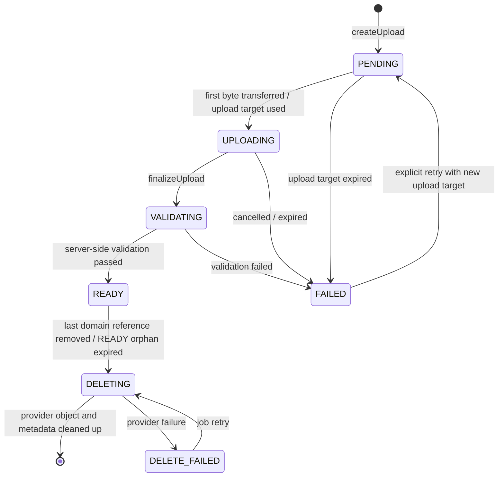

# M2 Media Pipeline

**Status:** binding M2-S0 media contract after #69, extended with M2-D14/D15 after #78 and M2-D23 after #85  
**Version:** 1.3

The goal is a secure, adapter-independent media flow for LocalMediaStore and S3MediaStore. Cloud media is never public; local filesystem paths and storage keys are not authorization mechanisms.

## 1. Binding lifecycle



`PENDING`, `UPLOADING`, `VALIDATING`, `READY`, `FAILED`, `DELETING`, and `DELETE_FAILED` are binding internal states. Clients may map `UPLOADING`, `VALIDATING`, `DELETING`, and `DELETE_FAILED` to more stable public states/progress presentation; they must not infer additional write permissions from those mappings.

`finalizeUpload` is idempotent. Two concurrent finalize requests may create exactly one effective validation run. State transitions are protected by a row lock or the existing serialization convention.

## 2. Attachment binding

M2 uses **exclusive attachment ownership per domain target**:

- An attachment belongs to exactly one `spaceId` and one immutable `ownerId`.
- A `READY` attachment may be bound to at most **one** domain resource.
- Reuse of the same attachment record across multiple parents is forbidden in M2. If the same media should appear in multiple places, a new attachment record/upload is created; content deduplication is not an M2 feature.
- Memory has an explicit `MemoryAttachment` relation with `memoryId`, `attachmentId`, and `position`.
- `position` is unique within a Memory, zero-based, and validated server-side; normal presentation sorts ascending by `position`, then stably by attachment ID.
- HeartMoment has at most one attachment; the concrete persistence form may be an FK or relation but must satisfy the same authorization/cleanup rules.
- Cross-space binding is always forbidden.
- An attachment may be bound only by its own owner. The target resource must be writable for that account.
- After successful binding, read permission follows the parent exclusively. Attachment ownership alone is not an alternate read path to a parent the owner can no longer read.

Exclusive binding makes cleanup and privacy deterministic and avoids implicit many-to-many authorization.

## 3. Components

```text
Client
  │  createUpload / finalize / bind / read
  ▼
Attachment API
  │  Membership + Resource Authorization
  ▼
Attachment Service ─────── Attachment Repository
  │                              │
  ▼                              └── Outbox / Job
MediaStore Interface                    │
  ├── LocalMediaStore                   └── validation / cleanup
  └── S3MediaStore
```

Domain code knows neither bucket, local path, nor concrete cloud provider.

## 4. Upload transport

One domain contract, two allowed adapter transports:

### LocalMediaStore

- Bytes flow through an authorized server-side streaming upload route.
- The request is bound to account, space, and attachment ID.
- The server enforces a streaming byte limit; it does not buffer an unlimited body fully in RAM.

### S3MediaStore

- `createUpload` may issue a short-lived presigned upload URL.
- TTL: **10 minutes**.
- The URL is bound to exactly one server-generated storage key and cannot select an arbitrary bucket/key.
- The bucket remains private; public ACLs are forbidden.
- Presigned URL, signature, and credentials are not logged or stored durably on the client.

For both adapters, `createUpload`, `finalizeUpload`, authorization, the state machine, and the validation decision remain server-controlled. A successful provider upload never means `READY`.

## 5. Storage key

Binding pattern:

```text
spaces/{spaceUuid}/attachments/{attachmentUuid}/original
```

- No user filename in the key.
- No sequential ID.
- No MIME type or privacy text in the path.
- Variants use only controlled server-side suffixes.
- `originalName` is protected/support metadata only and is never trusted for path, authorization, or content type.

## 6. Binding M2 media limits

M2 intentionally supports a small allowlist:

| Category | MIME | Max. individual size | Additional limit |
|---|---|---:|---|
| JPEG | `image/jpeg` | 25 MiB | max. 40 MP, max. 12,000 px per edge |
| PNG | `image/png` | 25 MiB | max. 40 MP, max. 12,000 px per edge |
| WebP | `image/webp` | 25 MiB | max. 40 MP, max. 12,000 px per edge |
| HEIC/HEIF | `image/heic`, `image/heif` | 25 MiB | max. 40 MP, max. 12,000 px per edge |
| MP4 Video | `video/mp4` | 250 MiB | max. 180 s, max. 3840×2160 |
| QuickTime Video | `video/quicktime` | 250 MiB | max. 180 s, max. 3840×2160 |

Additional formats, audio-only, RAW, GIF animation, MKV/WebM, and documents are outside the M2 contract and are rejected fail-closed until explicitly approved.

> **Delivery state (M2-D23):** the first media slice serves only the image rows in this table. MP4 and QuickTime remain part of the contract but are also rejected fail-closed with `ATTACHMENT_TYPE_NOT_ALLOWED` until the video slice. Clients must not offer video as available in M2 until then.

Additionally:

- Memory: at most **20 attachments** and at most **500 MiB declared/validated total size**.
- HeartMoment: at most **1 attachment**.
- Server values are binding; client limits are UX only.
- Size is determined from the actually stored object, not client metadata.
- Image dimensions and video duration are determined from server-detected media information.
- Declared MIME, filename extension, and original name are not trust sources.

## 7. Validation

Validation runs **asynchronously after `finalizeUpload`** using the existing job/Outbox style. `finalizeUpload` atomically sets `VALIDATING` and enqueues exactly one idempotent validation job; the client polls/refreshes the state.

Server-side checks:

1. The object exists exactly at the server-generated key.
2. Actual size is within the limit.
3. Magic Bytes / detected MIME are in the allowlist and compatible with the expected category.
4. Image dimensions/megapixels or video duration/resolution are within limits.
5. The parser can open the media safely under resource limits.
6. The attachment belongs to the expected space/owner and the state transition is allowed.
7. Provider/object integrity is sufficiently confirmed for the adapter.
8. The metadata allowlist is extracted and the object is then stored in sanitized form (M2-D14).

`READY` is set only after all eight steps pass. A provider upload or successful format check alone does not mean `READY`.

Derived variant generation (M2-D15) happens afterward and intentionally does **not** belong to this chain: its failure does not cause `FAILED`; see section 7.2.

On failure: `FAILED` with a stable, non-sensitive error code; the object is marked for cleanup. Parser failures or unknown types fail closed to `FAILED`.

A malware scanner is not defined as a universal security guarantee for M2. Uploads are handled only as media and are never executed server-side. A later AV/content-scan extension may extend the state machine, but must still set `READY` only after all mandatory checks pass.

### 7.1 Metadata removal (M2-D14)

Before stripping, exactly this allowlist is extracted and stored as ProtectedPayload:

| Field | Purpose |
|---|---|
| capture time | proposal source for `happenedOn` |
| orientation | correct presentation without client-side recoding |
| width, height | already determined for limit checking |
| duration (video only) | already determined for limit checking |

Everything else is discarded: GPS and other location information, device and serial numbers, software, author and copyright fields, comment and description fields, previews embedded in the container, and **every unlisted or unknown segment**. This is an allowlist, not a blacklist of known location fields — containers may carry position in vendor-specific and future segments.

Only the sanitized file is stored. Uploaded original bytes are not retained durably; M2 has no path that serves media with embedded metadata. Media that cannot be sanitized safely fails closed to `FAILED` and is never stored unstripped.

The extracted allowlist is ProtectedPayload and is not projected into API metadata outside the parent context, logs, events, metrics, or search indexes.

### 7.2 Derived variants (M2-D15)

M2 creates at most **one** variant per attachment:

| Category | Variant | Delivery state |
|---|---|---|
| Image | reduced thumbnail | first media slice |
| Video | single poster frame | video slice (M2-D23) |

Transcoding, multiple resolution levels, audio extraction, and adaptive streaming are **not** part of M2.

- Variants are created server-side in the same validation job, **after** M2-D14 is applied, so they contain no embedded metadata themselves.
- A variant has no independent authorization. It follows the attachment and therefore the parent exactly; a parent privacy change also blocks the variant.
- Clients do not select variant keys. The server names variants using controlled suffixes under the pattern in section 5.
- If variant generation fails, the attachment remains usable and is served without the variant. A missing thumbnail is a presentation issue, not a security failure, and does not set the attachment to `FAILED`.
- Cleanup removes variants together with the attachment. An orphaned variant object is a cleanup failure, not an allowed state.

## 8. Authorization

Attachment access is checked in two stages:

1. active membership in `spaceId`,
2. access to the allowed target resource or to an own still-unbound upload within its binding window.

```text
Account B requests Attachment X
  ├── Membership in Space?             no → 404/401 according to context
  ├── Attachment belongs to Space?     no → 404
  ├── bound?
  │     ├── yes: target reachable?     no → 404
  │     └── no: owner + binding window? no → 404
  ├── Target OWNER_ONLY of Account A?  yes → 404
  └── safe Read URL/stream             allowed
```

- An attachment cannot be read solely by its ID.
- A previous shared binding grants no continuing access if the target resource becomes private.
- PENDING/UPLOADING/VALIDATING/FAILED are manageable only by the owner and are not readable as regular parent content.
- READY without parent is visible only to the owner within the binding window.
- Binding and parent authorization occur in one DB transaction with race protection.

## 9. Read access

### LocalMediaStore: authorized streaming route

- The API checks every access immediately before `open()`.
- Range Requests, Content-Type, cache headers, and download name are controlled server-side.
- No filesystem paths in the response.

### S3MediaStore: short-lived signed Read URL

- The API checks membership and parent immediately beforehand.
- TTL: **5 minutes**.
- The URL has minimal scope to exactly one object.
- The bucket remains private.
- The URL is not stored in analytics, logs, Referrer, or durable client caches.
- After membership/privacy revocation, an already issued URL may technically remain valid only until its TTL ends; this limited residual period is an accepted M2 adapter trade-off and is minimized to 5 minutes.

## 10. READY binding window

An attachment may temporarily be `READY` and unbound after successful validation so upload and parent mutation remain decoupled.

- Binding window: **60 minutes from `readyAt`**.
- Within this window, only the owner may bind the attachment to an allowed parent in the same space.
- After binding, the orphan deadline no longer applies; lifetime follows the parent.
- Unbound READY after 60 minutes is atomically marked `DELETING` and removed by cleanup.
- A bind attempt concurrent with cleanup is serialized through row lock/state checking: either binding wins completely or cleanup does; no bound blob may be deleted.

## 11. Retention and cleanup

| State / trigger | Retention | Action |
|---|---:|---|
| PENDING without upload/finalize | 24 h from `createdAt` | `DELETING` + cleanup |
| UPLOADING without finalize | 24 h from last server-known activity, otherwise `createdAt` | `DELETING` + cleanup |
| FAILED | 24 h from `failedAt` | `DELETING` + cleanup |
| READY unbound | 60 min from `readyAt` | `DELETING` + cleanup |
| last parent reference removed / parent deleted | immediately unreferenced in domain | atomically mark `DELETING`; provider cleanup async |
| DELETE_FAILED | no automatic forgetting | exponential retry + alert/metric until success or manual intervention |

Cleanup removes original and derived variant together. It runs at least **hourly** and is idempotent. Production operation requires metrics for count/age of PENDING, FAILED, unbound READY, and DELETE_FAILED plus cleanup success/failure. No metric contains filenames or ProtectedPayload.

Provider deletion happens outside the domain DB transaction. A storage failure must not make an already deleted/private parent visible again.

## 12. Binding to domain resources

### Memory

- multiple attachments through `MemoryAttachment(position)`,
- maximum 20 / 500 MiB,
- only READY within the binding window is bindable,
- relation and state check are atomic,
- partial upload failure does not automatically modify an existing Memory.

### HeartMoment

- at most one optional attachment,
- attachment follows parent authorization,
- privacy change invalidates issuance of new Read Descriptors; an existing S3 Read URL may remain usable only until its 5-minute TTL ends.

### Milestone/Comment

Attachment support is not part of M2 and is not added silently.

## 13. Idempotency and concurrency

- `createUpload` with the same idempotency key creates at most one attachment.
- `finalizeUpload` is idempotent; READY remains READY, FAILED requires explicit retry.
- Retry from FAILED creates a new upload target for the same attachment record only while no binding exists; state/attempt is versioned/serialized server-side.
- Parent delete concurrent with bind/finalize cannot create a relation to a deleted parent.
- Last-reference delete concurrent with Read Descriptor issuance checks parent/state immediately before issuance.
- Cleanup concurrent with bind is serialized through row lock/state checking.

## 14. Crypto readiness

Attachment carries `cryptoVersion` and `encrypted`. MediaStore treats bytes as opaque. M2 does not claim real E2EE. Mandatory M2 validation requires server-readable content for supported media; a later real E2EE variant needs a newly decided client/validation contract and must not be treated as already solved.

## 15. Observability without leaks

Allowed:

- attachment ID,
- necessary space/account reference according to logging policy,
- adapter name,
- state transition,
- coarse byte class,
- duration,
- safe error code,
- job attempts.

Do not log:

- signed URL or Upload Descriptor,
- original filename,
- EXIF/location data,
- image/video content,
- Authorization header,
- storage credentials,
- storage key in user-exposed errors,
- complete provider responses containing sensitive data.

## 16. Acceptance criteria

- LocalMediaStore and S3MediaStore pass the same domain/lifecycle contract.
- Upload lifecycle is idempotent and race-safe.
- MIME, size, dimensions, duration, and space are checked server-side.
- Cross-tenant and owner-only retrieval produces no leaks.
- S3 Upload URL ≤10 min; Read URL ≤5 min; bucket is not public.
- PENDING/UPLOADING/FAILED ≤24 h; unbound READY ≤60 min.
- Orphans and failed deletes are cleaned up retryably and measured.
- Memory gallery and HeartMoment attachment respect cardinality/size limits.
- Logs, analytics, and events contain no media content, filenames, or signed URLs.
- Offline Write is not simulated.

## Related documents

- [Domain Model](./DOMAIN-MODEL.md)
- [API Design](./API-DESIGN.md)
- [Security Test Matrix](./SECURITY-TEST-MATRIX.md)
- [Decision Log](./DECISION-LOG.md)
