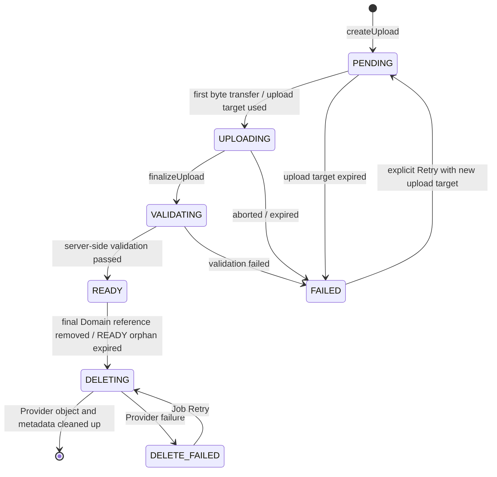

# M2 Media Pipeline

**Status:** binding M2-S0 Media contract after #69, supplemented with M2-D14/D15 after #78 and M2-D23 after #85  
**Version:** 1.3

The goal is a secure, adapter-independent Media flow for LocalMediaStore and S3MediaStore. Cloud Media is never public; local filesystem paths and Storage Keys do not become Authorization mechanisms.

## 1. Binding lifecycle



`PENDING`, `UPLOADING`, `VALIDATING`, `READY`, `FAILED`, `DELETING`, and `DELETE_FAILED` are binding internal states. Clients may map `UPLOADING`, `VALIDATING`, `DELETING`, and `DELETE_FAILED` to more stable public states/progress presentation; they must not derive additional write permissions from them.

`finalizeUpload` is idempotent. Two concurrent Finalize requests may produce exactly one effective validation run. State transitions are protected with Row Lock or the existing serialization convention.

## 2. Attachment binding

M2 uses **exclusive Attachment ownership per Domain target**:

- An Attachment belongs to exactly one `spaceId` and one immutable `ownerId`.
- A `READY` Attachment may be bound to at most **one** Domain resource.
- Reuse of the same Attachment record across multiple parents is prohibited in M2. If the same Media should appear in multiple places, a new Attachment record/upload is created; content deduplication is not an M2 feature.
- Memory has an explicit `MemoryAttachment` relation with `memoryId`, `attachmentId`, `position`.
- `position` is unique within a Memory, zero-based, and validated server-side; normal presentation sorts ascending by `position`, then stably by Attachment ID.
- HeartMoment has at most one Attachment; concrete persistence may be a FK or relation but must satisfy the same Authorization/Cleanup rules.
- Cross-Space binding is always forbidden.
- An Attachment may be bound only by its owner. The target resource must be writable by that Account.
- After successful binding, read permission follows only the parent. Attachment owner status alone is not an alternate read path to a parent the Account can no longer read.

This exclusive binding makes Cleanup and Privacy deterministic and avoids implicit many-to-many Authorization.

## 3. Components

```text
Client
  │  createUpload / finalize / bind / read
  ▼
Attachment API
  │  Membership + Resource Authorization
  ▼
Attachment Service ─────── Attachment Repository
  │                              │
  ▼                              └── Outbox / Job
MediaStore Interface                    │
  ├── LocalMediaStore                   └── validation / cleanup
  └── S3MediaStore
```

Domain code knows no Bucket, local path, or concrete Cloud Provider.

## 4. Upload transport

One Domain contract, two permitted adapter transports:

### LocalMediaStore

- Bytes flow through an authorized server-side streaming upload route.
- The request is bound to Account, Space, and Attachment ID.
- The server enforces a streaming byte limit; no complete unbounded buffering in RAM.

### S3MediaStore

- `createUpload` may issue a short-lived presigned Upload URL.
- TTL: **10 minutes**.
- The URL is bound to exactly one server-generated Storage Key and does not permit a freely selectable Bucket/Key.
- The Bucket remains private; Public ACLs are prohibited.
- Presigned URL, signature, and credentials are not logged or persistently stored in the client.

For both adapters, `createUpload`, `finalizeUpload`, Authorization, state machine, and the validation decision remain server-controlled. A successful Provider upload is never equivalent to `READY`.

## 5. Storage Key

Binding pattern:

```text
spaces/{spaceUuid}/attachments/{attachmentUuid}/original
```

- No user filename in the Key.
- No incrementing ID.
- No MIME type or Privacy text in the path.
- Variants use only controlled server-side suffixes.
- `originalName` is Protected/support metadata only and is never trusted for path, Authorization, or Content-Type.

## 6. Binding M2 Media limits

M2 deliberately supports a small positive allowlist:

| Category | MIME | Max individual size | additional limit |
|---|---|---:|---|
| JPEG | `image/jpeg` | 25 MiB | max 40 MP, max 12,000 px per edge |
| PNG | `image/png` | 25 MiB | max 40 MP, max 12,000 px per edge |
| WebP | `image/webp` | 25 MiB | max 40 MP, max 12,000 px per edge |
| HEIC/HEIF | `image/heic`, `image/heif` | 25 MiB | max 40 MP, max 12,000 px per edge |
| MP4 Video | `video/mp4` | 250 MiB | max 180 s, max 3840×2160 |
| QuickTime Video | `video/quicktime` | 250 MiB | max 180 s, max 3840×2160 |

Other formats, audio-only, RAW, animated GIF, MKV/WebM, and documents are not part of the M2 contract and are rejected fail-closed until explicitly approved.

> **Delivery state (M2-D23):** The first Media slice handles only the image rows in this table. MP4 and QuickTime remain part of the contract but are also rejected fail-closed with `ATTACHMENT_TYPE_NOT_ALLOWED` until the video slice. Clients must not present video as available in M2 until then.

Additionally:

- Memory: maximum **20 Attachments** and maximum **500 MiB declared/validated total size**.
- HeartMoment: maximum **1 Attachment**.
- Server values are binding; client limits are UX only.
- Size is determined from the actually stored object, not client metadata.
- Image dimensions and video duration are determined from server-recognized Media information.
- Declared MIME, file extension, and original name are not trusted sources.

## 7. Validation

Validation runs **asynchronously after `finalizeUpload`** using the existing Job/Outbox style. `finalizeUpload` atomically sets `VALIDATING` and enqueues exactly one idempotent validation job; the client polls/refreshes status.

Server-side checks:

1. object exists exactly at the server-generated Key,
2. actual size within limit,
3. Magic Bytes/recognized MIME is in the allowlist and compatible with the expected category,
4. image dimensions/megapixels or video duration/resolution within limit,
5. parser can safely open the Media under resource limits,
6. Attachment belongs to the expected Space/owner and the state transition is allowed,
7. Provider/object integrity is sufficiently confirmed for the adapter,
8. metadata allowlist is extracted and the object is then stored sanitized (M2-D14).

Only after all eight steps is `READY` set. A Provider upload or passed format check alone does not mean `READY`.

Generation of the derived variant (M2-D15) follows afterward and deliberately is **not** part of this chain: failure does not produce `FAILED`; see section 7.2.

On error: `FAILED` with a stable non-sensitive error code; object is marked for Cleanup. Parser errors or unknown types fail closed to `FAILED`.

A malware scanner is not defined as a universal security guarantee for M2. Uploads are treated exclusively as Media and are never executed server-side. A later AV/content-scan extension may extend the state machine but must still set `READY` only after all mandatory checks.

### 7.1 Metadata removal (M2-D14)

Before stripping, exactly this allowlist is extracted and stored as ProtectedPayload:

| Field | Purpose |
|---|---|
| capture timestamp | suggestion source for `happenedOn` |
| orientation | correct presentation without client re-encoding |
| width, height | already determined for limit checking |
| duration (video only) | already determined for limit checking |

Everything else is discarded: GPS and other location information, device and serial numbers, software, author and copyright fields, Comment and description fields, previews embedded in the container, and **every unlisted or unknown segment**. The rule is an allowlist, not a blacklist of known location fields — containers may carry position in vendor-specific and future segments.

Only the sanitized file is stored. Uploaded original bytes are not retained permanently; M2 has no path that serves Media with embedded metadata. Media that cannot be safely sanitized fails closed as `FAILED` and is never stored unstripped.

The extracted allowlist is ProtectedPayload and is not projected into API metadata outside the parent context, logs, Events, metrics, or Search indexes.

### 7.2 Derived variants (M2-D15)

M2 creates at most **one** variant per Attachment:

| Category | Variant | Delivery state |
|---|---|---|
| Image | reduced Thumbnail | first Media slice |
| Video | single Poster Frame | video slice (M2-D23) |

Transcoding, multiple resolution levels, audio extraction, and adaptive streaming are **not** part of M2.

- Variants are generated server-side in the same validation job, **after** applying M2-D14, and therefore contain no embedded metadata themselves.
- A variant has no independent Authorization. It follows exactly its Attachment and therefore the parent; a parent Privacy transition blocks the variant as well.
- Clients do not choose variant Keys. The server names variants through controlled suffixes according to the pattern in section 5.
- If variant generation fails, the Attachment remains usable and is served without a variant. A missing Thumbnail is a presentation issue, not a Security issue, and does not set the Attachment to `FAILED`.
- Cleanup removes variants together with the Attachment. An orphaned variant object is a Cleanup error, not an allowed state.

## 8. Authorization

Attachment access is checked in two stages:

1. active Membership in `spaceId`,
2. access to the permitted target resource or to the Account's own not-yet-linked upload within its binding window.

```text
Account B requests Attachment X
  ├── Membership in Space?              no → 404/401 according to context
  ├── Attachment belongs to Space?      no → 404
  ├── bound?
  │     ├── yes: target resource reachable? no → 404
  │     └── no: owner + binding window?     no → 404
  ├── target OWNER_ONLY for Account A?  yes → 404
  └── safe Read URL/Stream              allowed
```

- An Attachment must not be readable by ID alone.
- A previous Shared link grants no continued access after the target resource becomes private.
- PENDING/UPLOADING/VALIDATING/FAILED are manageable only by the owner and are not readable as normal parent content.
- READY without a parent is visible only to the owner inside the binding window.
- Binding and parent Authorization occur in a DB transaction with race protection.

## 9. Read access

### LocalMediaStore: authorized streaming route

- API checks every access immediately before `open()`.
- Range Requests, Content-Type, cache headers, and download name are server-controlled.
- no filesystem paths in the Response.

### S3MediaStore: short-lived signed Read URL

- API checks Membership and parent immediately beforehand.
- TTL: **5 minutes**.
- URL has minimum scope to exactly one object.
- Bucket remains private.
- URL is not stored in Analytics, logs, Referrer, or persistent client caches.
- After Membership/Privacy revocation, an already issued URL may technically remain valid only until TTL expiry; this bounded residual period is an accepted M2 adapter trade-off and is minimized to 5 minutes.

## 10. READY binding window

After successful validation an Attachment may temporarily be `READY` and still unbound so Upload and parent mutation remain decoupled.

- Binding window: **60 minutes from `readyAt`**.
- Within this window, only the owner may bind the Attachment to a permitted parent in the same Space.
- After binding, the orphan deadline no longer applies; lifetime follows the parent.
- Unbound READY after 60 minutes is atomically marked `DELETING` and removed by Cleanup.
- A Bind attempt concurrent with Cleanup is serialized through Row Lock/state check: either Bind wins completely or Cleanup wins; a bound Blob must never be deleted.

## 11. Retention and Cleanup

| State / cause | Retention | Action |
|---|---:|---|
| PENDING without Upload/Finalize | 24 h from `createdAt` | `DELETING` + Cleanup |
| UPLOADING without Finalize | 24 h from last server-known activity, otherwise `createdAt` | `DELETING` + Cleanup |
| FAILED | 24 h from `failedAt` | `DELETING` + Cleanup |
| READY unbound | 60 min from `readyAt` | `DELETING` + Cleanup |
| final parent reference removed / parent deleted | immediately unreferenced at Domain level | atomically mark `DELETING`; Provider Cleanup async |
| DELETE_FAILED | no automatic forgetting | exponential Retry + alert/metric until success or manual intervention |

Cleanup removes original and derived variant together. It runs at least **hourly** and is idempotent. Production operation requires metrics for count/age of PENDING, FAILED, unbound READY, and DELETE_FAILED plus Cleanup success/failure. No metric contains filenames or ProtectedPayload.

Provider deletion occurs outside the domain DB transaction. A Storage failure must not make an already deleted/private parent visible again.

## 12. Linking to Domain resources

### Memory

- multiple Attachments through `MemoryAttachment(position)`,
- maximum 20 / 500 MiB,
- only READY inside the binding window may be bound,
- relation and state check atomic,
- partial upload failure does not automatically alter an existing Memory.

### HeartMoment

- at most one optional Attachment,
- Attachment follows parent Authorization,
- Privacy transition invalidates issuance of new Read descriptors; an existing S3 Read URL may remain valid only for its 5-minute TTL.

### Milestone/Comment

Attachment support is not planned in M2 and is not silently added.

## 13. Idempotency and Concurrency

- `createUpload` with the same Idempotency Key creates at most one Attachment.
- `finalizeUpload` is idempotent; READY remains READY, FAILED requires explicit Retry.
- Retry from FAILED creates a new upload target for the same Attachment record only while no binding exists; state/attempt is versioned/serialized server-side.
- Parent Delete concurrent with Bind/Finalize cannot create a relation to a deleted parent.
- Final-reference Delete concurrent with Read descriptor issuance checks parent/state immediately before issuance.
- Cleanup concurrent with Bind is serialized by Row Lock/state check.

## 14. Crypto readiness

Attachment carries `cryptoVersion` and `encrypted`. MediaStore treats bytes as opaque. M2 does not claim real E2EE. Mandatory M2 validation requires server-readable content for supported Media; a later real-E2EE variant requires a newly decided client/validation contract and must not be treated as already solved.

## 15. Observability without leakage

Allowed:

- Attachment ID,
- necessary Space/Account reference according to Logging Policy,
- adapter name,
- state transition,
- coarse byte class,
- duration,
- safe error code,
- Job attempts.

Do not log:

- signed URL or Upload descriptor,
- original filename,
- EXIF/location data,
- image/video content,
- Authorization Header,
- Storage credentials,
- Storage Key in user-facing errors,
- complete Provider responses containing sensitive data.

## 16. Acceptance criteria

- LocalMediaStore and S3MediaStore satisfy the same Domain/lifecycle contract.
- Upload lifecycle is idempotent and race-safe.
- MIME, size, dimensions, duration, and Space are checked server-side.
- Cross-Tenant and owner-only reads leak nothing.
- S3 Upload URL ≤10 min; Read URL ≤5 min; Bucket not public.
- PENDING/UPLOADING/FAILED ≤24 h; unbound READY ≤60 min.
- Orphans and failed Deletes are cleaned up with Retry capability and are measured.
- Memory Gallery and HeartMoment Attachment respect cardinality/size limits.
- Logs, Analytics, and Events contain no Media content, filenames, or signed URLs.
- Offline Write is not simulated.

## Related documents

- [Domain Model](./DOMAIN-MODEL.md)
- [API Design](./API-DESIGN.md)
- [Security Test Matrix](./SECURITY-TEST-MATRIX.md)
- [Decision Log](./DECISION-LOG.md)
