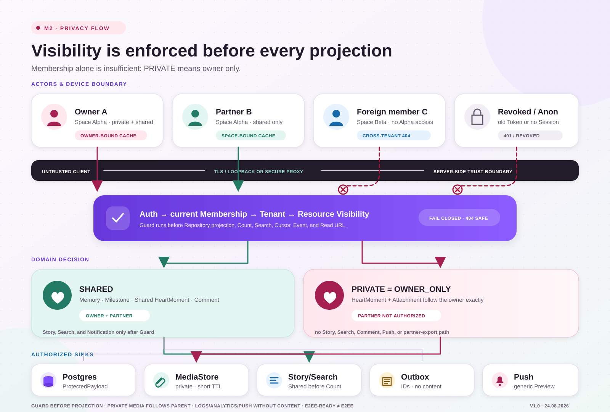

# M2 Privacy Threat Model

**Scope:** Memory, HeartMoment, Milestone, Comment, Story, and Attachment  
**Method:** data-flow- and abuse-case-oriented threat analysis  
**As of:** August 24, 2026

This model supplements the [Security Test Matrix](./SECURITY-TEST-MATRIX.md) with actors, trust boundaries, data flows, and concrete controls. It does not claim that M2 provides real end-to-end encryption.



## 1. Protection goals

1. **Confidentiality:** private HeartMoments are visible only to the owner.
2. **Tenant isolation:** no space can discover entities or media belonging to another space.
3. **Integrity:** author, space, visibility, version, and attachment relations cannot be reassigned by the client.
4. **Minimization:** logs, events, analytics, and notifications contain no protected content.
5. **Traceability:** domain change and minimal Domain Event commit atomically.
6. **Deletion effect:** deleted or privatized content is removed immediately from all authorized projections.
7. **E2EE readiness:** ProtectedPayload and MediaStore introduce no mandatory plaintext assumption.

## 2. Protected assets

| Asset | Sensitivity | Examples | Particular risk |
|---|---|---|---|
| ProtectedPayload | high | title, body, comment text | logs, search, Push, diagnostics |
| PRIVATE HeartMoment | very high | text, emotion, date, attachment | partner leak through indirect path |
| media content | high | photo, video, audio | public URL, cache, EXIF/GPS |
| relationship/space metadata | high | membership, author, visibility | social inference and IDOR |
| search/Story metadata | medium to high | hits, counts, cursor, months | existence leak without content |
| credentials and Read URLs | critical | session, signature, storage key | direct API bypass |
| local caches/drafts | high | Offline Read, unsaved text | wrong account/space, backup |
| Domain Events | medium to high | type, actor, target | content leak through payload expansion |

## 3. Actors and capabilities

| Actor | Legitimate access | Assumed capability |
|---|---|---|
| Owner `A` | own and shared content in Space Alpha | manipulates requests and knows own IDs |
| Partner `B` | shared content in Space Alpha | guesses/obtains private IDs and probes side channels |
| Foreign member `C` | content in Space Beta | attempts cross-tenant IDOR and cursor reuse |
| Revoked member `R` | no current access | possesses old tokens, URLs, or cache |
| Anonymous attacker | no access | scans routes, IDs, and media endpoints |
| Faulty integration | minimal event/Push access only | logs or projects too much |
| Internal operator | operational diagnostics | can see over-privileged logs/traces/backups |

The client and network are not trust anchors. Every domain operation enforces authentication, current membership, tenant, and resource visibility server-side.

## 4. Trust boundaries

```text
Device/Browser
  → public API boundary
    → Auth + Membership + Visibility Guard
      → Domain transaction + projection
        → Postgres / MediaStore
        → Outbox → Worker → Notification Provider
```

- **TB-1 Device:** cache, clipboard, screenshots, backups, and other apps.
- **TB-2 Transport/API:** manipulated IDs, bodies, cursors, MIME, and concurrency.
- **TB-3 Domain/Storage:** domain visibility versus physical blob/record.
- **TB-4 Async:** event, retry, Push Preview, and external providers.
- **TB-5 Operations:** logs, error tracking, metrics, support, and backups.

## 5. Data flows

| Flow | Source → destination | Data | Required control |
|---|---|---|---|
| DF-01 | Client → API | Create/Update DTO | schema, auth, membership, version |
| DF-02 | API → Domain | actor + space + operation | server-derived actor/space |
| DF-03 | Domain → Postgres | metadata + ProtectedPayload | tenant, transaction, minimal logs |
| DF-04 | Client → MediaStore | blob through upload path | non-guessable key, limits, finalize |
| DF-05 | Domain → Read Projection | Story/Detail/Search | visibility before count/sort/cursor |
| DF-06 | API → Client | DTO + Read URL/stream | authorization immediately before, short TTL |
| DF-07 | Domain → Outbox | minimal event | atomic, no content |
| DF-08 | Worker → Notification | generic preview | target authorization and data minimization |
| DF-09 | Client ↔ local cache | authorized read data/draft | owner/space binding, deletion/locking |

## 6. Threats and controls

| ID | Threat | Attack path | Impact | Required controls | Evidence |
|---|---|---|---|---|---|
| TM-01 | Cross-tenant IDOR | foreign UUID in Read/Write/Delete | data leak/mutation | tenant from membership, parent/child same space, privacy-safe 404 | HTTP isolation tests |
| TM-02 | Partner reads PRIVATE directly | known HeartMoment ID | severe privacy violation | central owner-only policy before repository projection | A/B canary by ID |
| TM-03 | PRIVATE leak through Story/Search | filtering only after count/pagination | existence, date, or timing leak | exclude before query/count/sort/cursor | count, cursor, timing tests |
| TM-04 | PRIVATE leak through relation | Comment/Attachment/Notification resolves parent indirectly | content or existence visible | parent visibility governs every relation | indirect canary suite |
| TM-05 | Public/long-lived media URL | bucket ACL or long-lived signature | uncontrolled retrieval | private storage defaults, short TTL, authorized stream/URL | URL expiry and ACL test |
| TM-06 | Upload spoofing | manipulated extension/MIME/container | malicious content, parser/resource attack | allowlist, actual MIME, size/pixel/duration limits, isolated processing | media abuse suite |
| TM-07 | Storage-key injection | filename/path used as key | overwrite/foreign access | server-generated UUID keys; name is metadata only | key contract test |
| TM-08 | Cache after logout/space change | browser/Android cache remains | access after context change | partition cache by owner/space and delete/lock | logout/switch E2E |
| TM-09 | Notification Preview | comment/title text in Push | lock-screen/provider leak | generic preview, minimal event, preferences | Push payload snapshot |
| TM-10 | Logging/analytics leak | request body, URL, or search text logged | internal/third-party leak | allowlist logging, redaction, no content properties | canary log scan |
| TM-11 | Visibility race | share/private concurrent with Comment/Read | unauthorized relation/short leak | version, transaction, guard at final Read/Event | race test |
| TM-12 | Revoked membership | old token/Read URL/cache | access after revocation | membership on API read, short URL TTL, cache lock | revocation E2E |
| TM-13 | Cursor/error oracle | cursor from another space, differing 403/404 | resource discovery | opaque space-bound cursor, neutral errors | manipulation matrix |
| TM-14 | Export/backup leak | PRIVATE in partner export or system backup | durable disclosure | separate owner and partner exports; cache/backup rule | export canary |
| TM-15 | Screenshot/Recents | private view in App Switcher | shoulder-surfing/OS artifact | explicit platform decision, optional screen protection | Android UX/security test |
| TM-16 | Outbox replay | worker delivers repeatedly | duplicate Push/side effects | idempotency/dedupe, minimal event version | retry test |
| TM-17 | Delete orphan | parent deleted, blob/index/cache remains | later rediscovery | immediate invisibility, idempotent cleanup, search-index SLA | delete/cleanup test |
| TM-18 | Diagnostics/support overreach | operator sees content | internal privacy violation | roles, break-glass, audit, redaction, retention | operations review |

## 7. Owner-only control point

For `PRIVATE`, there is one domain statement:

```text
visible(resource, actor) = resource.ownerId == actor.id
```

Membership in the same space is insufficient. This rule must apply before all of the following operations:

- detail, update, delete,
- list, search, count, filter, cursor,
- Story, Dashboard, Recap, recently opened,
- Comment target and Comment Count,
- attachment metadata, thumbnail, download, Read URL,
- event, notification, badge count,
- analytics, diagnostics, export, and cache projection.

## 8. Privacy canaries

Test data contains artificial markers:

- `CANARY-PRIVATE-LEA-7421` in private text,
- `private-lea-7421.jpg` as original name,
- a distinctive domain date,
- an attachment with a distinctive test hash.

Partner, foreign, and standard operator paths are scanned automatically for these markers. No marker may appear in a response, DOM, cache, log, trace, event, notification, export, or screenshot test fixture.

## 9. Client controls

### Web

- Partition Query/Service-Worker/image caches by owner and space.
- Logout/space change deletes or locks data before navigation.
- Do not write Read URLs to Local Storage, analytics, History, or durable cache.
- Never include private Deep Links in public metadata or server-rendered cache.

### Android

- Store sensitive local data encrypted and bound to account/space.
- No private content in general backup, clipboard, or Share Sheet.
- Notifications omit content preview by default.
- Decide and test Recents/screenshot behavior explicitly.
- No autonomous Offline Write worker in the MVP.

## 10. Async and observability contract

An M2 event contains at most:

```text
eventId · eventType · occurredAt · actorId · spaceId · targetType · targetId · version
```

No titles, bodies, comments, emotions, filenames, storage keys, or Read URLs. Every additional value requires privacy review and a documented consumer.

## 11. Residual risks and open decisions

| Topic | Residual risk | Required decision |
|---|---|---|
| signed URL after membership revocation | may remain usable until TTL ends | TTL/stream per adapter `M2-D13` |
| EXIF/GPS | closed by ingest stripping | decided in `M2-D14` |
| Shared → Private | already-read content/comments | comment rule `M2-D07` |
| Emotion | metadata versus ProtectedPayload | classification `M2-D06` |
| Android Recents | screenshot of private screen | platform rule |
| Export/Backup | different recipients and retention | `M2-D17`/`M2-D18` |

## 12. Release gate

M2 is not approved if:

- owner-only is implemented only in the controller or only through a UI filter,
- a partner canary is indirectly visible,
- media can be retrieved without parent authorization,
- Push, logs, or analytics carry protected content,
- logout/space change leaves private caches behind,
- cross-tenant and race tests do not run through the public API,
- the product claims E2EE when only E2EE readiness exists.
